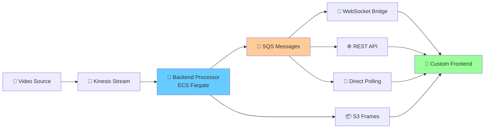

# 🎯 Guida Integrazione Frontend Personalizzato

## 📋 Panoramica

Il tuo **backend processor** (`stream_service/app_cloud.py`) è già pronto per l'integrazione con qualsiasi frontend personalizzato. I messaggi e le API sono standardizzati e compatibili.

## 🎮 Formato Messaggi JSON Standardizzato

### 📨 Messaggi SQS dal Backend Processor

Il backend invia automaticamente questi messaggi JSON a SQS:

```json
{
  "bucket": "processedframes-544547773663-eu-central-1",
  "key": "2025-01-13/14-30-15/frame_123_1737123456.jpg", 
  "frame_index": 123,
  "detections_count": 3,
  "summary": [
    {
      "class": "person",
      "conf": 0.85,
      "bbox": [0.1, 0.2, 0.3, 0.4]  // [x, y, width, height] normalizzati 0-1
    },
    {
      "class": "car",
      "conf": 0.92, 
      "bbox": [0.5, 0.3, 0.2, 0.4]
    }
  ],
  "timestamp": "2025-01-13T14:30:15.123456Z",
  "stream_name": "cv2kinesis"
}
```

### 🔑 Campi Chiave

| Campo | Tipo | Descrizione |
|-------|------|-------------|
| `bucket` | string | Nome S3 bucket con immagine processata |
| `key` | string | Chiave S3 del frame processato |
| `frame_index` | int | Numero progressivo del frame |
| `detections_count` | int | Numero oggetti rilevati |
| `summary` | array | Lista dettagliata delle detection |
| `timestamp` | string | Timestamp ISO 8601 UTC |
| `stream_name` | string | Nome dello stream Kinesis |

### 📍 Formato Bounding Box

Le coordinate `bbox` sono **normalizzate** (0.0 - 1.0):
- `[x, y, width, height]`
- `x, y`: Posizione angolo top-left  
- `width, height`: Dimensioni del box

## 🛠️ Metodi di Integrazione

### 🔧 Opzione 1: Polling SQS Diretto

Il tuo frontend può interrogare direttamente la coda SQS:

```python
import boto3
import json

class CustomFrontendBackend:
    def __init__(self, sqs_queue_url, aws_region='eu-central-1'):
        self.sqs = boto3.client('sqs', region_name=aws_region)
        self.s3 = boto3.client('s3', region_name=aws_region)
        self.queue_url = sqs_queue_url
    
    def poll_detection_results(self):
        """Legge nuovi risultati dal backend processor"""
        response = self.sqs.receive_message(
            QueueUrl=self.queue_url,
            MaxNumberOfMessages=10,
            WaitTimeSeconds=20  # Long polling
        )
        
        messages = response.get('Messages', [])
        results = []
        
        for message in messages:
            try:
                # Parse JSON dal backend
                detection_data = json.loads(message['Body'])
                results.append(detection_data)
                
                # Cancella messaggio processato
                self.sqs.delete_message(
                    QueueUrl=self.queue_url,
                    ReceiptHandle=message['ReceiptHandle']
                )
                
            except json.JSONDecodeError as e:
                print(f"Errore parsing JSON: {e}")
        
        return results
    
    def download_processed_frame(self, bucket, key):
        """Scarica frame processato da S3"""
        try:
            response = self.s3.get_object(Bucket=bucket, Key=key)
            return response['Body'].read()
        except Exception as e:
            print(f"Errore download S3: {e}")
            return None
    
    def get_frame_presigned_url(self, bucket, key, expiration=3600):
        """Genera URL firmato per accesso S3"""
        return self.s3.generate_presigned_url(
            'get_object',
            Params={'Bucket': bucket, 'Key': key},
            ExpiresIn=expiration
        )
```

### ⚡ Opzione 2: WebSocket Bridge

Crea un bridge WebSocket che trasforma SQS in eventi real-time:

```python
import asyncio
import websockets
import json
from custom_frontend_backend import CustomFrontendBackend

class WebSocketBridge:
    def __init__(self, sqs_queue_url):
        self.backend = CustomFrontendBackend(sqs_queue_url)
        self.connected_clients = set()
    
    async def register_client(self, websocket):
        """Registra nuovo client frontend"""
        self.connected_clients.add(websocket)
        print(f"✅ Client connesso (totale: {len(self.connected_clients)})")
    
    async def unregister_client(self, websocket):
        """Rimuovi client disconnesso"""
        self.connected_clients.discard(websocket)
        print(f"❌ Client disconnesso (totale: {len(self.connected_clients)})")
    
    async def poll_and_broadcast(self):
        """Polling SQS e broadcast a WebSocket clients"""
        while True:
            try:
                # Leggi messaggi dal backend processor
                detection_results = self.backend.poll_detection_results()
                
                for result in detection_results:
                    # Genera URL per immagine
                    frame_url = self.backend.get_frame_presigned_url(
                        result['bucket'], result['key']
                    )
                    
                    # Prepara messaggio per frontend
                    frontend_message = {
                        "type": "detection_update",
                        "stream_name": result['stream_name'],
                        "frame_index": result['frame_index'],
                        "detections_count": result['detections_count'],
                        "objects": result['summary'],
                        "timestamp": result['timestamp'],
                        "frame_url": frame_url
                    }
                    
                    # Broadcast a tutti i client connessi
                    await self.broadcast_message(frontend_message)
                
                await asyncio.sleep(1)  # Polling ogni secondo
                
            except Exception as e:
                print(f"❌ Errore polling: {e}")
                await asyncio.sleep(5)
    
    async def broadcast_message(self, message):
        """Invia messaggio a tutti i client WebSocket"""
        if not self.connected_clients:
            return
        
        message_str = json.dumps(message)
        disconnected_clients = set()
        
        for client in self.connected_clients:
            try:
                await client.send(message_str)
            except websockets.exceptions.ConnectionClosed:
                disconnected_clients.add(client)
        
        # Rimuovi client disconnessi
        for client in disconnected_clients:
            await self.unregister_client(client)
    
    async def websocket_handler(self, websocket, path):
        """Handler per connessioni WebSocket"""
        await self.register_client(websocket)
        try:
            async for message in websocket:
                # Gestisci comandi dal frontend se necessario
                await self.handle_frontend_command(websocket, message)
        except:
            pass
        finally:
            await self.unregister_client(websocket)
    
    async def handle_frontend_command(self, websocket, message_str):
        """Gestisce comandi dal frontend"""
        try:
            command = json.loads(message_str)
            # Implementa logica comandi personalizzati
            print(f"📨 Comando frontend: {command}")
        except json.JSONDecodeError:
            print("❌ Comando non valido")

# Avvia server WebSocket Bridge
async def start_bridge_server():
    bridge = WebSocketBridge("https://sqs.eu-central-1.amazonaws.com/544547773663/processing-results")
    
    # Avvia polling in background
    asyncio.create_task(bridge.poll_and_broadcast())
    
    # Avvia server WebSocket
    await websockets.serve(bridge.websocket_handler, "localhost", 8080)
    print("🌐 WebSocket Bridge avviato su ws://localhost:8080")

if __name__ == "__main__":
    asyncio.run(start_bridge_server())
```

### 🌐 Opzione 3: REST API Bridge

Crea un'API REST per accesso sincrono:

```python
from flask import Flask, jsonify, request
from custom_frontend_backend import CustomFrontendBackend

app = Flask(__name__)
backend = CustomFrontendBackend("https://sqs.eu-central-1.amazonaws.com/544547773663/processing-results")

@app.route('/api/detections', methods=['GET'])
def get_latest_detections():
    """API per ottenere ultime detection"""
    try:
        limit = request.args.get('limit', 10, type=int)
        results = backend.poll_detection_results()
        
        # Arricchisci con URL immagini
        for result in results[:limit]:
            result['frame_url'] = backend.get_frame_presigned_url(
                result['bucket'], result['key']
            )
        
        return jsonify({
            "success": True,
            "count": len(results),
            "detections": results[:limit]
        })
        
    except Exception as e:
        return jsonify({
            "success": False,
            "error": str(e)
        }), 500

@app.route('/api/streams/<stream_name>/status', methods=['GET'])
def get_stream_status(stream_name):
    """API per stato di uno stream specifico"""
    # Implementa logica per monitorare singolo stream
    return jsonify({
        "stream_name": stream_name,
        "active": True,
        "last_update": "2025-01-13T14:30:15Z"
    })

if __name__ == '__main__':
    app.run(host='0.0.0.0', port=5000, debug=True)
```

## 🔧 Frontend JavaScript Integration

### WebSocket Client Example

```javascript
class DetectionClient {
    constructor(websocketUrl = 'ws://localhost:8080') {
        this.ws = new WebSocket(websocketUrl);
        this.onDetectionCallback = null;
        
        this.ws.onopen = () => {
            console.log('✅ Connesso al backend processor');
        };
        
        this.ws.onmessage = (event) => {
            try {
                const data = JSON.parse(event.data);
                if (data.type === 'detection_update' && this.onDetectionCallback) {
                    this.onDetectionCallback(data);
                }
            } catch (e) {
                console.error('❌ Errore parsing messaggio:', e);
            }
        };
        
        this.ws.onclose = () => {
            console.log('❌ Connessione chiusa');
            // Auto-reconnect
            setTimeout(() => this.reconnect(), 3000);
        };
    }
    
    onDetection(callback) {
        this.onDetectionCallback = callback;
    }
    
    sendCommand(command, params = {}) {
        if (this.ws.readyState === WebSocket.OPEN) {
            this.ws.send(JSON.stringify({
                command: command,
                ...params
            }));
        }
    }
    
    reconnect() {
        this.ws = new WebSocket(this.ws.url);
    }
}

// Usage nel tuo frontend
const detectionClient = new DetectionClient();

detectionClient.onDetection((data) => {
    console.log(`🎯 Nuove detection per ${data.stream_name}:`, data);
    
    // Update UI
    updateStreamCard(data.stream_name, {
        objectCount: data.detections_count,
        objects: data.objects,
        frameUrl: data.frame_url,
        timestamp: data.timestamp
    });
});

function updateStreamCard(streamName, data) {
    const card = document.getElementById(`card-${streamName}`);
    if (!card) return;
    
    // Update detection count
    card.querySelector('.detection-count').textContent = data.objectCount;
    
    // Update frame image
    const frameImg = card.querySelector('.frame-image');
    if (data.frameUrl) {
        frameImg.src = data.frameUrl;
    }
    
    // Update object list
    const objectsList = card.querySelector('.objects-list');
    objectsList.innerHTML = '';
    
    data.objects.forEach(obj => {
        const item = document.createElement('div');
        item.className = 'object-item';
        item.innerHTML = `
            <span class="object-class">${obj.class}</span>
            <span class="object-confidence">${(obj.conf * 100).toFixed(1)}%</span>
        `;
        objectsList.appendChild(item);
    });
    
    // Update timestamp
    card.querySelector('.timestamp').textContent = 
        new Date(data.timestamp).toLocaleTimeString();
}
```

## 📦 Stack di Deploy per Frontend

### Stack CDK Output

Il backend processor è già deployato e fornisce questi output:

```yaml
LoadBalancerURL: http://VideoPipelineStack-ServiceLBE9A1ADBC-123456789.eu-central-1.elb.amazonaws.com
KinesisStreamName: cv2kinesis
S3BucketName: processedframes-544547773663-eu-central-1
SQSQueueURL: https://sqs.eu-central-1.amazonaws.com/544547773663/processing-results
SQSQueueName: processing-results
```

### Variabili Environment per Frontend

```bash
# Configurazione backend processor
AWS_REGION=eu-central-1
SQS_QUEUE_URL=https://sqs.eu-central-1.amazonaws.com/544547773663/processing-results
S3_BUCKET_NAME=processedframes-544547773663-eu-central-1
KINESIS_STREAM_NAME=cv2kinesis

# Configurazione opzionale
BACKEND_PROCESSOR_URL=http://VideoPipelineStack-ServiceLBE9A1ADBC-123456789.eu-central-1.elb.amazonaws.com
WEBSOCKET_BRIDGE_PORT=8080
REST_API_PORT=5000
```

## 🎯 Test di Integrazione

### Test Rapido con il Consumer Esistente

```bash
# Test lettura messaggi SQS
python sqs_consumer.py https://sqs.eu-central-1.amazonaws.com/544547773663/processing-results

# Questo ti mostrerà esattamente il formato che riceverai nel tuo frontend
```

### Esempio Output Atteso

```
================================================================================
📨 PROCESSING RESULT RECEIVED
================================================================================
🎯 Detections: 2
📸 Frame: 1234
⏰ Timestamp: 2025-01-13T14:30:15.123456Z
🎥 Stream: cv2kinesis
📦 S3 Location: s3://processedframes-544547773663-eu-central-1/2025-01-13/14-30-15/frame_1234_1737123456.jpg
🔍 Detected objects:
   1. person (confidence: 0.85, bbox: [0.1, 0.2, 0.3, 0.4])
   2. car (confidence: 0.92, bbox: [0.5, 0.3, 0.2, 0.4])
✅ Message processed and deleted from queue
================================================================================
```

## 🚀 Prossimi Passi per l'Integrazione

1. **📋 Scegli Metodo**: Polling SQS, WebSocket Bridge, o REST API
2. **🔧 Implementa Backend**: Usa gli esempi sopra come base
3. **🌐 Connetti Frontend**: WebSocket o REST client
4. **🧪 Test**: Usa il consumer esistente per validare i messaggi
5. **🎨 UI**: Integra detection data nella tua UI personalizzata

## 💡 Compatibilità Garantita

Il formato dei messaggi è **identico** tra:
- ✅ Backend processor cloud (app_cloud.py)
- ✅ Consumer di test (sqs_consumer.py)  
- ✅ Dashboard demo (frontend_dashboard.html)
- ✅ Il tuo frontend personalizzato

**Non servono modifiche al backend processor!** È già pronto per l'integrazione immediata.

## 🔗 Architettura Completa



Il tuo **Custom Frontend** può integrarsi tramite **qualsiasi** di questi metodi con il **Backend Processor** già esistente!
