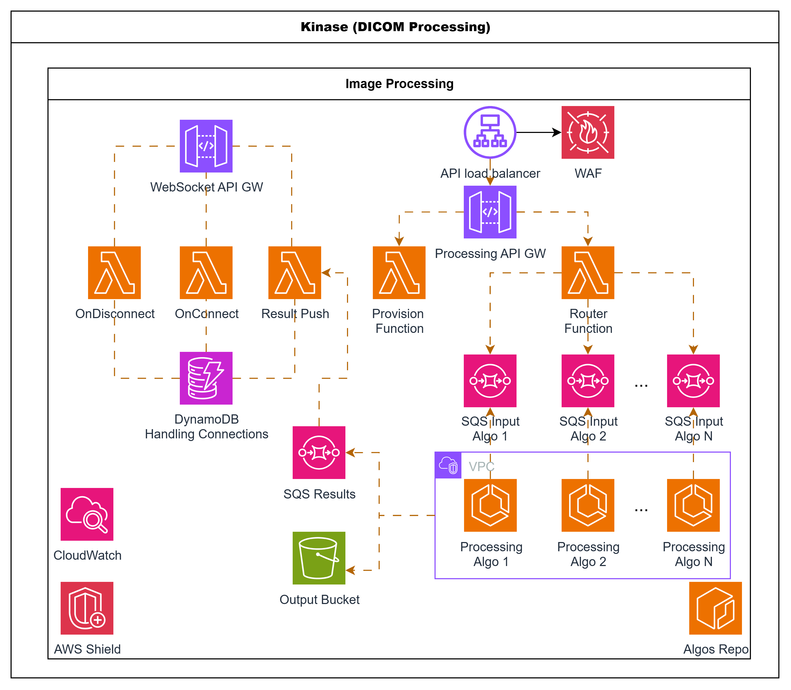
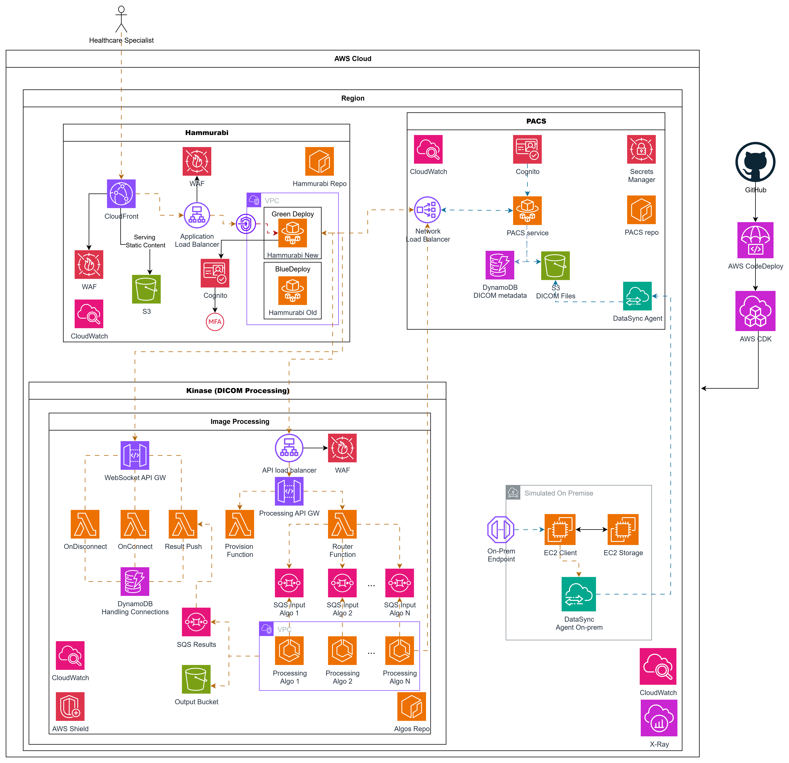

## 🏗️ Architettura Dinamica
## 5️⃣ End-to-end user flow

1. **PACS Preview**
   - Enter `study_id`, `series_id`, `image_id`, `scope=image`
   - Click _Load Preview_ → view original image
2. **Client provision**
   - Click _Provision client_ → receive only `client_id`
3. **Start processing**
   - Click _Start processing_ → send POST to `$API_BASE/process/processing_1` with PACS payload + `client_id`
   - Lambda Router puts job on SQS Requests
   - Fargate Worker processes and publishes to ResultsQueue.fifo
   - Lambda ResultPush sends result via WebSocket to correct client
4. **Receive results (push)**
   - Frontend opens WebSocket to `wss://.../prod?client_id=...`
   - When message arrives (`job_id`), see processed image API REST → DynamoDB Registry → SQS Requests → Fargate → SQS Results.fifo → Lambda ResultPush → WebSocket API → Client
```

### Componenti Principali
## 4️⃣ Generazione variabili d'ambiente
- **Client**: invia job via HTTP
- **API Gateway**: espone endpoint REST + Admin API
- **DynamoDB Registry**: registro dinamico degli algoritmi
- **Provisioner Lambda**: crea risorse ECS/SQS on-demand
- **Dynamic Router**: smista job basandosi sul registro
- **SQS Requests**: code FIFO create dinamicamente per ogni algoritmo
- **Fargate Workers**: processano i job (Python o OpenMP/nativi)
- **SQS Results.fifo**: coda FIFO unica per tutti i risultati
- **Lambda ResultPush**: invia i risultati via WebSocket
- **WebSocket API**: notifiche push dei risultati ai client
- **Frontend React**: provisioning, invio job, ricezione risultati real-time

### 🆕 Nuove Funzionalità

- ✅ **Registro dinamico** - aggiungi algoritmi senza redeploy CDK
- ✅ **API Admin** - gestione algoritmi via REST API
- ✅ **Supporto OpenMP** - algoritmi nativi con adapter pattern
- ✅ **Provisioning automatico** - code e servizi creati automaticamente
- ✅ **Sicurezza migliorata** - ruoli IAM granulari per algoritmo

---

## 5️⃣ Flusso utente end‑to‑end

1. **Anteprima PACS**
   - Inserisci `study_id`, `series_id`, `image_id`, `scope=image`
   - Clicca _Carica Anteprima_ → visualizzi l’immagine originale
2. **Provision client**
   - Clicca _Provisiona client_ → ricevi solo `client_id`
3. **Avvio processing**
   - Clicca _Avvia processing_ → invia POST a `$API_BASE/process/processing_1` con payload PACS + `client_id`
   - Lambda Router mette il job su SQS Requests
   - Fargate Worker elabora e pubblica su ResultsQueue.fifo
   - Lambda ResultPush invia il risultato via WebSocket al client giusto
4. **Ricezione risultati (push)**
   - Il frontend apre una WebSocket a `wss://.../prod?client_id=...`
   - Quando arriva il messaggio (`job_id`), vedi l’immagine processata

---

## Output deploy

- DNS PACS API LB (`PacsApiLB`)
- API Gateway endpoint (`ProcessingApiEndpoint`)
- URL SQS Requests per ogni algoritmo
- WebSocket endpoint (`WebSocketEndpoint`)
- ResultsQueueUrl (`ResultsQueueUrl`)

**Variabili disponibili:**
- `$Env:API_BASE`         → API Gateway
- `$Env:PACS_API_BASE`    → DNS PACS API
- `$Env:WS_ENDPOINT`      → WebSocket endpoint
- `$Env:RESULTS_QUEUE_URL`→ ResultsQueueUrl

---

## Best practice e monitoraggio

- Lambda on_disconnect: fail fast (retry 0), return 200 se nessun item trovato.
- Lambda result_push: logging avanzato e metriche CloudWatch EMF per push, failure e disconnect.
- Lambda push: batch/concurrency SQS, Lambda Insights, retention log 1 giorno.
- Frontend: reconnessione WebSocket automatica, ping ogni 5 min, fallback toast se non parte.
- Monitoring: ApproximateAgeOfOldestMessage su ResultsQueue, allarmi su PushFailures/Disconnected.

---

# Diagrammi architetturali

## Focus su Kinase - DICOM image(s) processing


## Flusso architetturale (completo)



---

# Try it!

---

## 🛠️ Prerequisites

- AWS CLI configured (CloudFormation, ECR, ECS, SQS, SNS, Lambda, IAM)
- AWS CDK v2
- Docker
- PowerShell (Windows) or Bash (Linux/macOS)
- Node.js + npm (for React frontend)

---

## 1️⃣ ECR Preparation

**Create repositories and push images**

```powershell
cd infra/ecr
./create-ecr-repos.ps1 -Region <REGION> -Account <ACCOUNT_ID>
docker build --no-cache -t mip-base:latest -f containers/base/Dockerfile . #if you want to restart from base without cache
./push-algos.ps1 -Region <REGION> -Account <ACCOUNT_ID>
./push-pacs.ps1 -Region <REGION> -Account <ACCOUNT_ID>
```

> _Note: <REGION> ex. eu-central-1 or us-east-1; <ACCOUNT_ID> ex. 544547773663._

---

## 2️⃣ Infrastructure Deployment with CDK

**Complete deployment with automatic script:**
```powershell
cd infra
.\deploy-complete.ps1 -Region us-east-1 -Account 544547773663
```

**Or manual:**
```bash
cd infra
npm install   # only if there are node dependencies
cdk deploy Imports --require-approval never
cdk deploy PacsApi --require-approval never
cdk deploy ImgPipeline --require-approval never
# or
cdk deploy --all --require-approval never
```

**Deploy outputs:**
- PACS API LB DNS (`PacsApiLB`)
- API Gateway endpoint (`ProcessingApiEndpoint`)
- WebSocket endpoint (`WebSocketEndpoint`)
- ResultsQueueUrl (`ResultsQueueUrl`)
- Algorithm Registry table (`AlgoTableName`)

---

## 3️⃣ Gestione Algoritmi (Nuovo!)

### Registra algoritmo Python esistente
```bash
curl -X POST "$API_BASE/admin/algorithms" \
  -H "Content-Type: application/json" \
  -H "x-admin-key: dev-admin" \
  -d '{
    "algo_id": "processing_1",
    "image_uri": "544547773663.dkr.ecr.us-east-1.amazonaws.com/mip-algos:processing_1",
    "cpu": 1024,
    "memory": 2048,
    "command": ["/app/worker.sh"]
  }'
```

### Registra algoritmo OpenMP/nativo
```bash
curl -X POST "$API_BASE/admin/algorithms" \
  -H "Content-Type: application/json" \
  -H "x-admin-key: dev-admin" \
  -d '{
    "algo_id": "my_openmp_algo",
    "image_uri": "544547773663.dkr.ecr.us-east-1.amazonaws.com/mip-algos:openmp",
    "cpu": 2048,
    "memory": 4096,
    "command": ["/app/adapter.py"],
    "env": {"OMP_NUM_THREADS": "4"}
  }'
```

### Gestione algoritmi
```bash
# Lista tutti gli algoritmi
curl -H "x-admin-key: dev-admin" "$API_BASE/admin/algorithms"

# Dettagli specifico algoritmo
curl -H "x-admin-key: dev-admin" "$API_BASE/admin/algorithms/processing_1"

# Aggiorna algoritmo
curl -X PATCH "$API_BASE/admin/algorithms/processing_1" \
  -H "Content-Type: application/json" \
  -H "x-admin-key: dev-admin" \
  -d '{"cpu": 2048, "memory": 4096}'

# Scale down temporaneo
curl -X DELETE "$API_BASE/admin/algorithms/processing_1" \
  -H "x-admin-key: dev-admin"

# Rimozione completa
curl -X DELETE "$API_BASE/admin/algorithms/processing_1?hard=true" \
  -H "x-admin-key: dev-admin"
```

---

## 3️⃣ Generazione variabili d’ambiente

Script PowerShell per raccogliere gli output CDK:

```powershell
./gen_env/gen_env.ps1 -ImgStack "ImgPipeline" -PacsStack "PacsApiStack"
. ./infra/env.ps1   # importa le variabili in sessione
```

---

## 4️⃣ Frontend React

```bash
cd infra/clients/react-app
npm ci
npm start
```

Nel file `src/index.jsx`:
```js
const API_BASE  = process.env.API_BASE    || '<YOUR_API_GATEWAY_BASE>';
const PACS_BASE = process.env.PACS_API_BASE || '<YOUR_PACS_API_BASE>';
```
Apri il browser su [http://localhost:3000](http://localhost:3000).

---
