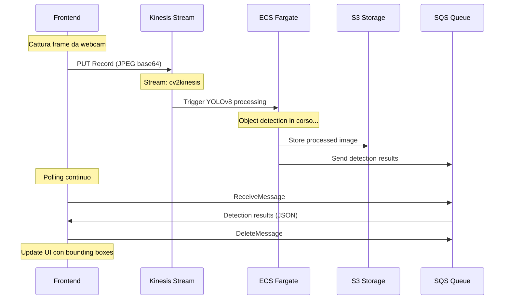

# 🚀 Frontend Integration Guide
## Video Pipeline con Object Detection Real-time

---

### 📋 Architettura della Soluzione

```mermaid
graph TB
    subgraph "Frontend Application"
        FE[🎥 Webcam Capture<br/>JavaScript/React]
    end
    
    subgraph "AWS Infrastructure (Backend Deploy)"
        KDS[📡 Kinesis Data Stream<br/>'cv2kinesis']
        ECS[🐳 ECS Fargate<br/>YOLOv8 Processing]
        S3[📦 S3 Bucket<br/>Processed Images]
        SQS[📨 SQS Queue<br/>'processing-results']
    end
    
    subgraph "Data Flow"
        FE -->|PUT Record<br/>JPEG Base64| KDS
        KDS -->|Trigger| ECS
        ECS -->|Store| S3
        ECS -->|Publish| SQS
        SQS -->|Poll Results| FE
    end
    
    style FE fill:#e1f5fe
    style KDS fill:#f3e5f5
    style ECS fill:#fff3e0
    style S3 fill:#e8f5e8
    style SQS fill:#fff8e1
```



### 🏗️ Deploy Backend Infrastructure

Il backend viene deployato completamente con un singolo comando:

```bash
python deploy_and_test.py
# Opzione 1: Build e deploy completo
```

**Cosa viene creato automaticamente:**
- ✅ Kinesis Data Stream per video input
- ✅ ECS Fargate cluster con YOLOv8 
- ✅ ECR repository per Docker images
- ✅ S3 bucket per storage risultati
- ✅ SQS queue per output detection
- ✅ IAM roles e security groups
- ✅ Load balancer e networking

## 🎯 Cosa Deve Fare il Frontend

### 1. **INVIO VIDEO** (Producer)
Il frontend deve inviare il video al Kinesis Data Stream:

```javascript
// Esempio JavaScript/TypeScript
import AWS from 'aws-sdk';

const kinesis = new AWS.Kinesis({
    region: 'eu-central-1',
    accessKeyId: 'YOUR_ACCESS_KEY',
    secretAccessKey: 'YOUR_SECRET_KEY'
});

// Funzione per inviare frame video
async function sendVideoFrame(videoData) {
    const params = {
        StreamName: 'cv2kinesis',
        Data: videoData, // Buffer del video
        PartitionKey: 'video-processing'
    };
    
    try {
        await kinesis.putRecord(params).promise();
        console.log('Frame inviato con successo');
    } catch (error) {
        console.error('Errore invio frame:', error);
    }
}
```

### 2. **RICEZIONE RISULTATI** (Consumer)
Il frontend riceve i risultati processati via SQS:

```javascript
import AWS from 'aws-sdk';

const sqs = new AWS.SQS({
    region: 'eu-central-1',
    accessKeyId: 'YOUR_ACCESS_KEY',
    secretAccessKey: 'YOUR_SECRET_KEY'
});

// Funzione per ricevere risultati
async function receiveResults() {
    const params = {
        QueueUrl: 'https://sqs.eu-central-1.amazonaws.com/544547773663/processing-results',
        MaxNumberOfMessages: 10,
        WaitTimeSeconds: 20
    };
    
    try {
        const data = await sqs.receiveMessage(params).promise();
        if (data.Messages) {
            data.Messages.forEach(message => {
                const result = JSON.parse(message.Body);
                console.log('Risultato ricevuto:', result);
                
                // Elabora il risultato (es. mostra bounding boxes)
                processDetectionResult(result);
                
                // Cancella il messaggio dalla coda
                sqs.deleteMessage({
                    QueueUrl: params.QueueUrl,
                    ReceiptHandle: message.ReceiptHandle
                }).promise();
            });
        }
    } catch (error) {
        console.error('Errore ricezione risultati:', error);
    }
}

function processDetectionResult(result) {
    // result contiene:
    // - timestamp
    // - detections: array di oggetti rilevati
    // - s3_url: URL dell'immagine processata
    
    result.detections.forEach(detection => {
        console.log(`Rilevato: ${detection.class} (confidence: ${detection.confidence})`);
        // Disegna bounding box sul video
    });
}
```

## 🔧 Setup Configurazione

### Credenziali AWS
```javascript
// Opzione 1: Credenziali dirette (solo per test)
const AWS_CONFIG = {
    region: 'eu-central-1',
    accessKeyId: 'YOUR_ACCESS_KEY',
    secretAccessKey: 'YOUR_SECRET_KEY'
};

// Opzione 2: IAM Role (produzione)
// Configurare IAM role per il frontend con permessi:
// - kinesis:PutRecord su video-stream
// - sqs:ReceiveMessage su processing-results
// - sqs:DeleteMessage su processing-results
```

### Variabili di Ambiente
```javascript
const CONFIG = {
    KINESIS_STREAM_NAME: 'cv2kinesis',
    SQS_QUEUE_URL: 'https://sqs.eu-central-1.amazonaws.com/544547773663/processing-results',
    AWS_REGION: 'eu-central-1'
};
```

## 🎥 Integrazione Video

### Cattura Video da Webcam
```javascript
// Cattura video dalla webcam
async function startVideoCapture() {
    const stream = await navigator.mediaDevices.getUserMedia({ 
        video: { width: 640, height: 480 } 
    });
    
    const video = document.getElementById('videoElement');
    video.srcObject = stream;
    
    // Cattura frame ogni 100ms
    setInterval(() => {
        captureAndSendFrame(video);
    }, 100);
}

function captureAndSendFrame(video) {
    const canvas = document.createElement('canvas');
    canvas.width = video.videoWidth;
    canvas.height = video.videoHeight;
    
    const ctx = canvas.getContext('2d');
    ctx.drawImage(video, 0, 0);
    
    // Converti in base64 o buffer
    canvas.toBlob(async (blob) => {
        const arrayBuffer = await blob.arrayBuffer();
        await sendVideoFrame(new Uint8Array(arrayBuffer));
    }, 'image/jpeg', 0.8);
}
```

## 📦 Package Dependencies

### Node.js/React
```json
{
  "dependencies": {
    "aws-sdk": "^2.1540.0",
    "@aws-sdk/client-kinesis": "^3.0.0",
    "@aws-sdk/client-sqs": "^3.0.0"
  }
}
```

### Python (se usi Flask/Django backend)
```txt
boto3==1.34.0
opencv-python==4.8.1.78
```

## 🔄 Workflow Completo

### 1. Inizializzazione
```javascript
// Setup servizi AWS
const kinesis = new AWS.Kinesis(AWS_CONFIG);
const sqs = new AWS.SQS(AWS_CONFIG);

// Avvia cattura video
startVideoCapture();

// Avvia polling risultati
setInterval(receiveResults, 1000);
```

### 2. Processing Loop
```javascript
// Loop principale
async function videoProcessingLoop() {
    while (isProcessing) {
        // 1. Cattura frame
        const frame = captureFrame();
        
        // 2. Invia a Kinesis
        await sendVideoFrame(frame);
        
        // 3. Ricevi risultati
        await receiveResults();
        
        // 4. Aggiorna UI
        updateVideoDisplay();
        
        await sleep(100); // 10 FPS
    }
}
```

## 🎨 UI Components

### React Component Esempio
```jsx
import React, { useEffect, useState } from 'react';

function VideoProcessor() {
    const [detections, setDetections] = useState([]);
    const [isProcessing, setIsProcessing] = useState(false);
    
    useEffect(() => {
        if (isProcessing) {
            startVideoProcessing();
        }
    }, [isProcessing]);
    
    const startVideoProcessing = async () => {
        // Setup video capture e AWS services
        await initializeServices();
        
        // Start processing loop
        videoProcessingLoop();
    };
    
    return (
        <div className="video-processor">
            <video id="videoElement" autoPlay muted />
            <button onClick={() => setIsProcessing(!isProcessing)}>
                {isProcessing ? 'Stop' : 'Start'} Processing
            </button>
            
            <div className="detections">
                {detections.map((detection, i) => (
                    <div key={i} className="detection">
                        {detection.class}: {detection.confidence}%
                    </div>
                ))}
            </div>
        </div>
    );
}
```

## 💻 Esempio HTML Completo

Abbiamo preparato un **demo HTML completo e funzionante** che puoi usare come riferimento:

**[frontend-example.html](frontend-example.html)** - Demo HTML standalone

### Caratteristiche del Demo:
- ✅ **Interfaccia completa** con video capture e risultati
- ✅ **Setup AWS credentials** via form
- ✅ **Real-time detection display** con oggetti rilevati
- ✅ **Error handling** e status monitoring
- ✅ **Responsive design** con layout moderno
- ✅ **Pronto all'uso** - basta aprire nel browser

### Come Usare il Demo:
1. Apri `frontend-example.html` nel browser
2. Inserisci le tue credenziali AWS
3. Clicca "Start Processing"
4. Concedi accesso alla webcam
5. Guarda le detection real-time!

Questo demo è perfetto per:
- 🧪 **Testare** l'integrazione frontend
- 📚 **Capire** il flusso di dati
- 🎨 **Ispirarti** per la tua implementazione
- 🛠️ **Debug** problemi di integrazione

## 🚨 Note Importanti

### Prestazioni
- **Frame Rate**: Limita a 10 FPS per evitare sovraccarico
- **Qualità**: Usa JPEG compression (quality: 0.7-0.8)
- **Timeout**: Configura timeout per SQS long polling

### Sicurezza
- **Non esporre** credenziali AWS nel frontend
- Usa **IAM roles** o **temporary credentials**
- Implementa **rate limiting** per Kinesis

### Error Handling
```javascript
// Gestione errori robusta
async function safeKinesisPublish(data) {
    const maxRetries = 3;
    for (let i = 0; i < maxRetries; i++) {
        try {
            await kinesis.putRecord(data).promise();
            return;
        } catch (error) {
            console.warn(`Retry ${i + 1}/${maxRetries}:`, error);
            await sleep(1000 * (i + 1)); // Exponential backoff
        }
    }
    throw new Error('Failed to publish after retries');
}
```

## 📞 Support

**Backend già deployato e funzionante:**
- ✅ Kinesis Stream: `cv2kinesis`
- ✅ ECS Fargate con YOLOv8
- ✅ S3 Storage per risultati
- ✅ SQS Queue: `processing-results`

**Contatti per supporto tecnico:**
- Repository: `c:\Users\giacomo.pedemonte\repos\cv2kinesis`
- Scripts di test disponibili: `deploy_and_test.py`, `sqs_consumer.py`

---
*Architettura testata e production-ready! 🚀*

### 🔄 Flusso di Dati Dettagliato



### 🎯 Formato Dati Input/Output

#### 📤 Input Kinesis (Frame Video)
```json
{
    "timestamp": "2024-12-19T10:30:00Z",
    "frame_id": "frame_123", 
    "frame_data": "base64_encoded_jpeg_data",
    "format": "jpeg",
    "source": "frontend-webcam"
}
```

#### 📥 Output SQS (Risultati Detection)
```json
{
    "timestamp": "2024-12-19T10:30:02Z",
    "frame_id": "frame_123",
    "detections": [
        {
            "class": "person",
            "confidence": 0.95,
            "x": 100, "y": 150,
            "width": 80, "height": 200
        },
        {
            "class": "cell phone", 
            "confidence": 0.87,
            "x": 300, "y": 200,
            "width": 50, "height": 100
        }
    ],
    "s3_url": "https://s3.amazonaws.com/bucket/processed_frame_123.jpg"
}
```
