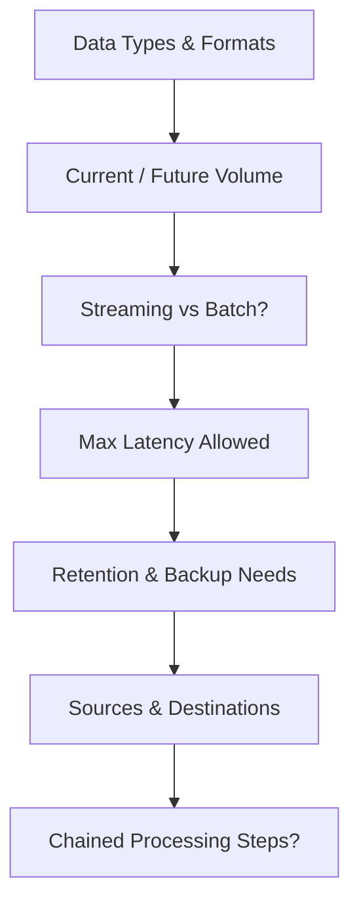
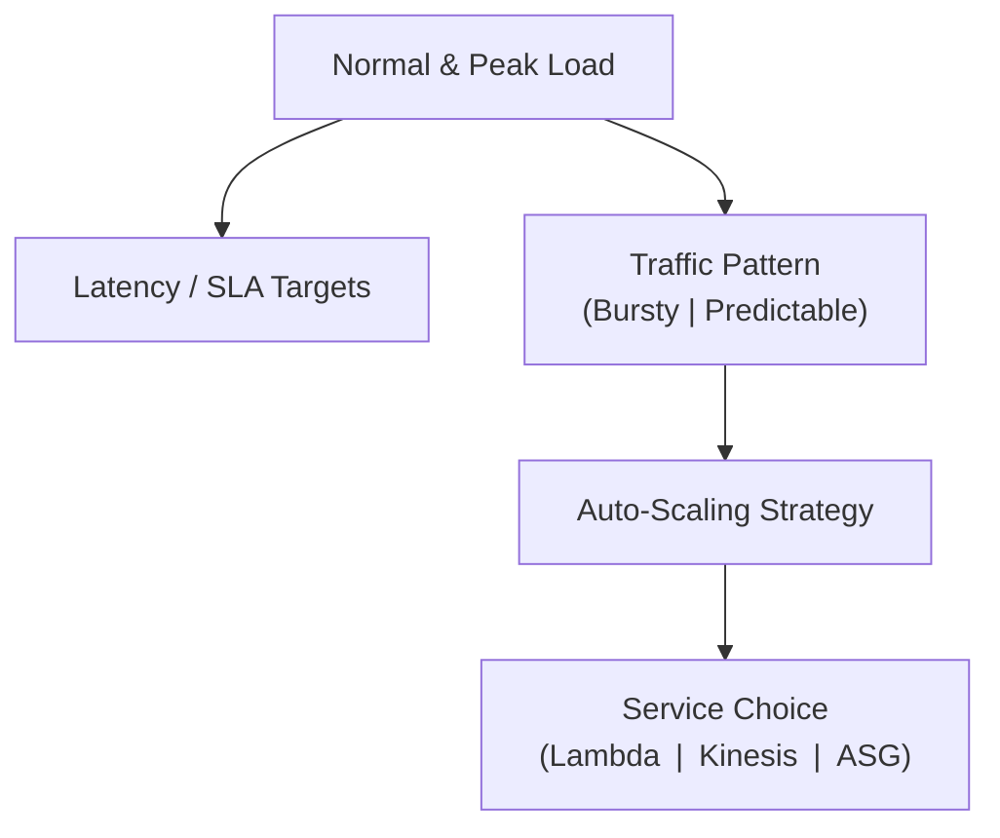
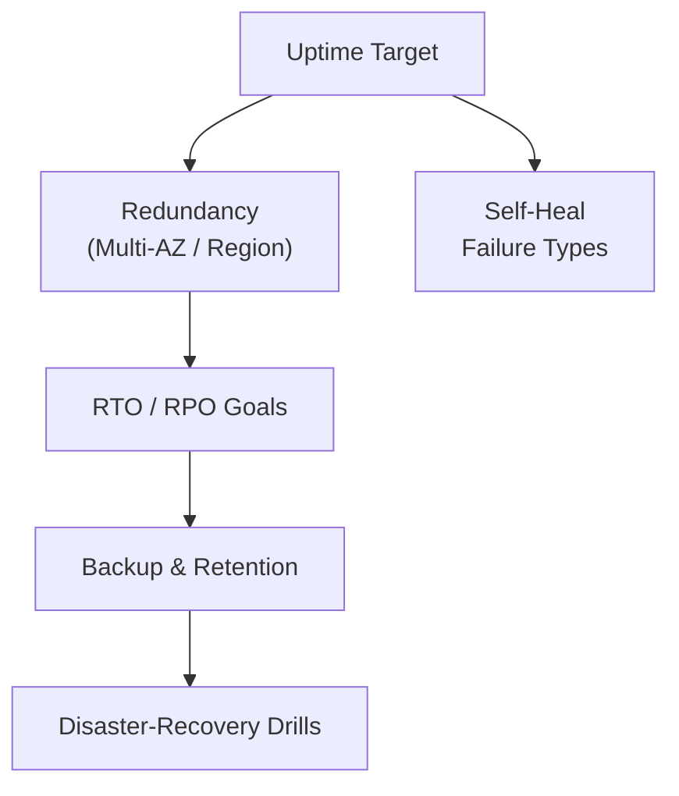
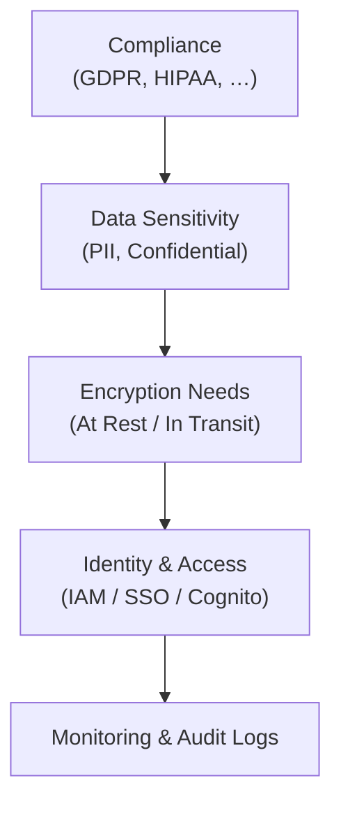
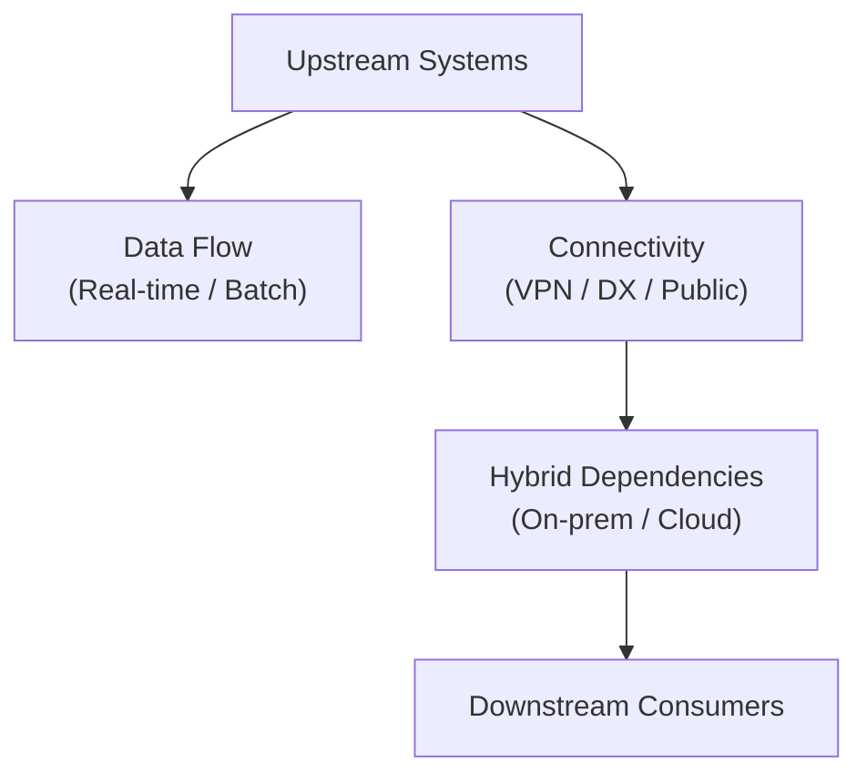
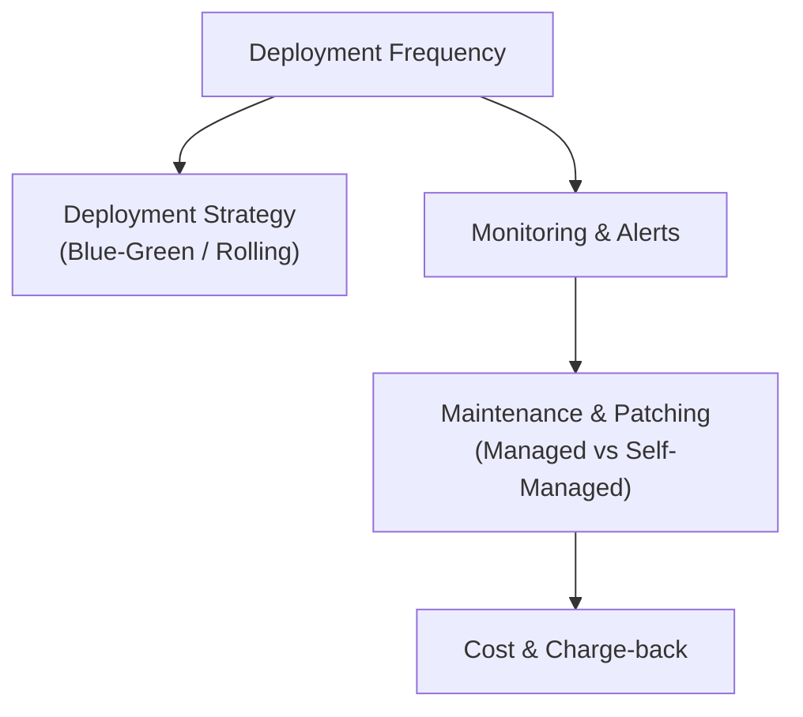

### *Questions to improve and define business case:*

### *Data Characteristics and Volume:*

* ***Data Types and Formats:*** *“What type of data will the system handle?”* List each major category: e.g. sensor telemetry (numeric/log data), transactional records, images or video streams, free text logs, etc. This influences services: e.g. streaming event data might imply Amazon Kinesis Data Streams, while large files might reside in Amazon S3. If media (video/audio) is involved, ote that (AWS has specialized services like Kinesis Video Streams for video ingest ). Structured data might fit relational databases; unstructured data might go to NoSQL or S3.

* **Data Volume:** *“How much data do you expect to handle, both now and in the future?”* Try to quantify: events per second, GB per day, number of records, etc. Also ask if they anticipate this volume to grow (and by what rate). Knowing the scale will prevent under-designing. For instance, Kinesis Data Streams can continuously capture gigabytes per second from hundreds of thousands of sources – if your use case approaches that range, Kinesis is a strong candidate. If volumes are small, simpler solutions (even a cron job writing to a database) could suffice. 

* **Data Velocity (Streaming vs. Batch):** *“How quickly must data be processed, and is real-time insight needed?”* Determine if the use cases demand streaming data processing or if batching is acceptable. For example, if you need real-time alerts or dashboard updates within seconds, that leans toward streaming architectures (AWS Kinesis, Amazon MSK, AWS IoT, or EventBridge with Lambda). “If you have a streaming use case and want a fully managed AWS service, consider Amazon Kinesis.” Conversely, if hourly or daily processing is fine (e.g. nightly reports), a batch approach using AWS Glue, Amazon EMR, or scheduled AWS Lambda/Batch jobs might be more cost-effective. Also ask *“What is the maximum latency tolerated between data input and result?”* (e.g. can it be a few seconds, minutes, or hours?). This will clarify the streaming vs batch decision. 

* **Retention and Storage:** *“How long do you need to retain the data, and how will it be accessed later?”* For example, logs might need 1 year retention for compliance, or sensor data might be kept indefinitely for analytics. If long-term storage is needed, services like Amazon S3 with lifecycle policies to Glacier can be considered. Also, *“Do you have backup or retention requirements?”* – this tells if we need to design for periodic backups, point-in-time recovery (for databases), and so on. 

* **Data Sources and Destinations:** *“Where is the data coming from and going to?”* Identify producers and consumers of data.

* **Data obtained by chain flows:** *"Are processing that needs to be chained with other ones before throwing a results?"* For instance a first step for a cleaning algorithm, the second steps for OCR and the third step maybe can apply other processing.

### *Performance and Scalability Requirements:*

* <b>Throughput \& Load:</b> *“What is the expected load on the system?”* Determine normal and peak loads in terms of users, transactions per second, requests per minute, etc. Also ask *“When/where do you expect peaks or spikes?”* For example, “Baseline usage vs. peak spikes – and when do those happen?”(perhaps business hours, end of month reporting, Black Friday, etc.). This helps in choosing scalable services. If traffic is spiky, you might favor serverless or auto-scaling solutions that handle bursts (like Lambda, DynamoDB, Kinesis scaling, or EC2 Auto Scaling groups). A steady but high load might be fine with provisioned throughput services or reserved capacity.

* **Latency \& Response Times:** *“How fast must the system respond to requests or data events?”* Define any SLA for response time (e.g. API calls must return within 200ms on average), or processing time for data pipelines (e.g. new data should be processed within 5 seconds).

* **Scalability \& Growth:** *“Are usage patterns predictable enough to schedule scaling, or do we need auto-scaling that reacts on-demand?”* The answers will guide whether to use features like AWS Auto Scaling, AWS Application Auto Scaling (for services like Kinesis or DynamoDB), etc.

### *Reliability, Availability, and Recovery:*

* **Availability Requirements:** *“How critical is uptime for this system?”* and *“What is the impact if the application goes down?”* If it’s mission-critical (e.g. an e-commerce site losing revenue per minute of downtime), you’ll want high-availability architecture (load balancing, multi-AZ deployments, maybe even multi-region failover). If brief downtime is tolerable, a simpler setup might suffice. Clarify any Service Level Agreement (SLA) or uptime target (e.g. *“99.9% uptime?”*) and maintenance window allowances.

* **Redundancy and Failover:** *“What sort of redundancy is in place today? How many data centers (or regions) does it run in?”* This reveals current resilience. If they only run in one on-prem datacenter and suffer outages, moving to AWS with multi-AZ could be a selling point. Ask if they require geographic redundancy (for disaster recovery or low latency to users in different regions). If yes, you might design active-active or active-passive multi-region setups using Route 53, CloudFront, global databases, etc. If no, perhaps a simpler single-region, multi-AZ design is fine.

* **Recovery Objectives:** *“Do you have Recovery Time Objective (RTO) or Recovery Point Objective (RPO) targets?”* In non-technical terms, how quickly must the system be recoverable after a failure, and how much data loss is acceptable. For example, *“We need to be back online within 1 hour and can only lose at most 5 minutes of data.”* These targets guide whether you need real-time replication (e.g. Aurora Global Database for near-zero RPO, multi-site active systems for near-zero RTO) or if nightly backups and a few hours of restoration are okay. If they don’t know, try to derive it from impact – critical systems often aim for low RTO/RPO.

* **Backup and Restore:** *“What are the backup requirements and retention policies for data?”* Identify which data must be backed up (databases, file storage, etc.), how often, and how long to keep backups. This helps in planning use of AWS Backup, database snapshots, cross-region backups, etc. Also ask if they have ever performed Disaster Recovery drills or have a DR plan – if not, that’s something you might incorporate with AWS (since AWS offers easier ways to automate DR).

* **Fault Tolerance:** *“Which failures do we need to tolerate automatically?”* This is a technical way of asking if the system can have any single points of failure. For instance, if an EC2 instance dies, is it acceptable to be down until manual intervention, or must it heal itself? If the answer is the latter, you’d use auto-scaling groups or services like AWS ECS with Service Auto Scaling, etc. Similarly, ask if *“the system needs to handle AZ outages or even region outages transparently.”* The more critical the system, the more you leverage AWS features like multi-AZ services (almost all AWS managed services support multi-AZ deployments for HA) or multi-region replication.

### *Security and Compliance:*

* **Compliance Standards:** *“What compliance or regulatory frameworks apply to this data/application?”* For example, GDPR (data residency and deletion requirements), HIPAA (health data – needs AWS services that are HIPAA eligible and strong encryption/audit), and so on…

* **Data Sensitivity:** *“Does the system handle sensitive data, and how is it classified?”* (public, internal, confidential, secret, etc.). If there’s personal identifiable information (PII) or other sensitive data, you’ll likely need to enforce encryption, tighter access controls, and choose services accordingly (for instance, using AWS Key Management Service for managing encryption keys, or sticking to dedicated resources if isolation is a concern).

* **Encryption Requirements:** *“Must data be encrypted in transit, at rest, or both – and any specific encryption standards?”* Most AWS services offer encryption (S3, EBS, RDS, etc. can encrypt data at rest; AWS ACM and other features handle in-transit). Clarify if they have their own keys (customer-managed keys via KMS) or if AWS-managed keys are acceptable. Also, if using SSL/TLS, ask if they have existing certificates or a preference for Certificate Authorities (which might mean using AWS Certificate Manager).

* **Access Control:** *“How will users and applications authenticate and be authorized?”* Determine if they have an Identity Provider (e.g. Active Directory/LDAP, SAML for SSO) that needs integration with AWS IAM or Cognito. If the application has end-users, will you use Amazon Cognito for user pools, or an existing system? Also ask about internal access: *“Who should have access to the AWS resources and how will we manage roles/permissions?”* This is about IAM roles and policies – you may not design it all now, but if they have a strict separation of duties or need federated access, plan for that.

* **Monitoring and Auditing:** *“What are the logging and monitoring requirements from a security standpoint?”* This to define detailed logs of access and usage. 

### *Integration and Ecosystem Considerations:*

* <b>Upstream/Downstream Systems:</b> *“What other systems will this solution need to integrate with?”* Make a list of inbound integrations (systems providing data to AWS) and outbound integrations (systems consuming data or receiving outputs). This could include on-premise databases, third-party APIs, internal tools, etc. For each, determine integration requirements: e.g. real-time vs batch, protocols (API calls, file transfers, etc.). This influences service choice (for instance, for streaming integration from on-prem, maybe use Kinesis Agent or IoT; for periodic data loads, DataSync or Transfer Family might be options).

* **Connectivity:** *“How will we connect AWS with your on-prem environment?”* (VPN, AWS Direct Connect, etc.). If a secure low-latency link is required, Direct Connect might be in scope; if casual connectivity, VPN could do. The need for hybrid networking will mean using Amazon VPC, potentially AWS Transit Gateway, and ensuring chosen services can operate in that VPC (e.g. Lambda in a VPC for database access).

* **Data Flow \& Dependencies:** *“Are there dependencies between components or data flows we should be aware of?”* For example, does this new system depend on an existing database for some data? If so, does that database remain on-prem or will it move to AWS? Identifying such links is crucial so you can plan data migration or synchronization. If some components must stay on-prem (due to compliance or other reasons), your AWS architecture might revolve around a hybrid model (using AWS Storage Gateway, Database Migration Service, etc., as needed).

##### *Operational and Maintenance Needs:*

* **Deployment \& CI/CD:** We touched on this earlier, but get specifics. *“How often will the application be updated, and do you want automated deployments?”* If the answer is very frequently (multiple times a day), investing in AWS CodePipeline/CodeDeploy or using services that enable rapid deployment (like AWS Lambda or containers) will be important. If updates are rare, they might be okay with manual deploys or simpler methods. Knowing this helps decide on things like blue-green or rolling deployment strategies (Elastic Beanstalk, ECS, and Lambda all support different deployment methods).

* **Monitoring \& Alerts:** *“What is required for monitoring the health and performance of the system?”* If there’s an ops team, they might have tools or thresholds. This can guide you to use Amazon CloudWatch for custom metrics and alarms, or AWS X-Ray for tracing if needed. If they need 24/7 alerting, you may incorporate Amazon SNS or third-party integrations for on-call rotation alerts. While this doesn’t choose a core service, it’s part of the AWS solution (and could affect whether you choose fully managed services with built-in monitoring vs. self-managed on EC2 where you’d have to set up more yourself).

* **Maintenance \& Patching:** *“Who will maintain the system and do we have preferences for managed services versus self-managed?”* Some teams may prefer AWS to handle as much as possible (leaning toward AWS Lambda, DynamoDB, Aurora Serverless, etc. which reduce admin overhead). Others might be okay managing EC2 instances or containers. If the team is small or not very ops-focused, recommending serverless or managed services can be wise so they aren’t burdened with patching OS or running databases.

* **Cost Management:** Operations also includes cost monitoring. You might ask, *“Do you need cost usage reports or chargeback detail for internal teams?”* If so, consider how you’ll use AWS Cost Explorer or create cost allocation tags by component. This is more for later once services are chosen, but it’s good to know if they care deeply about cost tracking (which could lead you to design the AWS account structure accordingly, e.g. multiple accounts for isolation of billing).

---

### In short, all the relevant questions are:

#### Data Characteristics & Volume
- *What data types/formats (images, video, telemetry, etc.) will the platform ingest?*
- *What is the expected data volume now and in the future (events /s, GB /day)?*
- *Is processing required in real-time streaming or periodic batch? What is the maximum tolerated latency?*
- *How long must raw and processed data be retained, and are there backup/restore requirements?*
- *Where do data originate and where must results be delivered?*
- *Does processing need to be chained through multiple algorithm steps?*

#### Performance & Scalability
- *What are the normal and peak workloads (req/min, users, FPS)?*
- *What response-time or SLA targets must the system meet?*
- *Are usage patterns predictable or bursty? Do we need on-demand auto-scaling?*

#### Reliability & Recovery
- *How critical is uptime? What availability target (e.g. 99.9 %) is required?*
- *What redundancy or fail-over strategy (multi-AZ/region) is acceptable?*
- *What RTO/RPO must we meet for disaster recovery?*
- *What backup cadence and retention policies are mandatory?*
- *Which failures must the system self-heal from (instance, AZ, region)?*

#### Security & Compliance
- *Which compliance frameworks (GDPR, HIPAA, etc.) apply?*
- *What is the sensitivity classification of the data?*
- *Must data be encrypted in transit, at rest, or both—and with whose keys?*
- *How will users and services authenticate and be authorized (IAM, SSO, Cognito)?*
- *What logging, monitoring, and auditing are required for security?*

#### Integration & Ecosystem
- *Which upstream systems feed data and which downstream systems consume results?*
- *How will AWS connect to on-prem or other clouds (VPN, Direct Connect)?*
- *Are there inter-service data dependencies or hybrid components that must stay on-prem?*

#### Operations & Maintenance
- *How often will code or algorithms be deployed; is automated CI/CD expected?*
- *What monitoring and alerting thresholds are needed for 24 × 7 operations?*
- *Who will handle patching and maintenance; are managed services preferred?*
- *Do we need detailed cost reporting or charge-back by tenant/team?*
