# Hybrid Pipeline AWS - Image & Video Processing

## Obiettivo
Pipeline ibrida per processare **immagini** e **video** in modo completamente event-driven e serverless su AWS, sfruttando servizi gestiti per orchestrazione, scalabilità e monitoraggio.

---

## Architettura Completa

### Diagramma Generale

```mermaid
flowchart TD
    %% Legenda
    classDef aws fill:#f7f7f7,stroke:#232f3e,stroke-width:2px,color:#232f3e;
    classDef s3 fill:#f0fff0,stroke:#2e8b57,stroke-width:2px,color:#2e8b57;
    classDef lambda fill:#fffbe6,stroke:#f7b731,stroke-width:2px,color:#f7b731;
    classDef stepfn fill:#e6f7ff,stroke:#0073bb,stroke-width:2px,color:#0073bb;
    classDef ecs fill:#e6e6fa,stroke:#5a189a,stroke-width:2px,color:#5a189a;
    classDef kinesis fill:#e0f7fa,stroke:#00bcd4,stroke-width:2px,color:#00bcd4;
    classDef sqs fill:#fff0f5,stroke:#c71585,stroke-width:2px,color:#c71585;
    classDef lb fill:#f0f8ff,stroke:#4682b4,stroke-width:2px,color:#4682b4;
    classDef user fill:#f5f5f5,stroke:#333,stroke-width:2px,color:#333;
    classDef consumer fill:#f5f5f5,stroke:#333,stroke-width:2px,color:#333;

    %% Image Pipeline
    User1([👤 Utente/Servizio]):::user
    S3Input([🗂️ ImageInputBucket]):::s3
    LambdaDispatcher([🦸‍♂️ ImageS3DispatcherLambda]):::lambda
    StepFunc([🔗 ImageProcessingStateMachine]):::stepfn
    ECSGray([🖥️ ECS Fargate: GrayscaleTask]):::ecs
    S3Output([🗂️ ImageOutputBucket]):::s3
    SQSImage([📨 SQS FIFO: image-processing-results]):::sqs

    User1 --Upload--> S3Input
    S3Input --Event--> LambdaDispatcher
    LambdaDispatcher --Trigger--> StepFunc
    StepFunc --Run ECS--> ECSGray
    ECSGray --Process--> S3Output
    ECSGray --Send Metrics--> SQSImage

    %% Video Pipeline
    User2([👤 Utente/Servizio]):::user
    S3VideoInput([🗂️ VideoInputBucket]):::s3
    Kinesis([🔀 Kinesis VideoFrameStream]):::kinesis
    ECSYolo([🖥️ ECS Fargate: YOLOTask]):::ecs
    S3Frames([🗂️ VideoFramesBucket]):::s3
    SQSVideo([📨 SQS FIFO: video-processing-results]):::sqs
    LB([🌐 Load Balancer]):::lb

    User2 --Upload--> S3VideoInput
    S3VideoInput --Frames--> Kinesis
    Kinesis --Stream--> ECSYolo
    ECSYolo --Save--> S3Frames
    ECSYolo --Send Results--> SQSVideo
    ECSYolo --Expose--> LB

    %% Consumer
    Consumer([👁️ Consumer]):::consumer
    SQSImage --Notify--> Consumer
    SQSVideo --Notify--> Consumer

```

---

### Image Processing Pipeline

---

### Video Processing Pipeline

---

## Componenti Principali

- **S3**: Bucket per input/output immagini e video
- **Lambda**: Dispatcher per trigger S3 → Step Functions
- **Step Functions**: Orchestrazione workflow (image)
- **ECS Fargate**: Container per grayscale (C/OpenMP) e YOLO (video)
- **Kinesis**: Streaming frame video
- **SQS FIFO**: Code per risultati (image/video)
- **ECR**: Repository immagini container
- **Load Balancer**: Accesso HTTP al servizio video

---

## Mapping tra CDK e Servizi Custom

- **Grayscale Service**: `services/grayscale_service/app_aws.py` (AWS), orchestrato da Step Functions, container ECS Fargate
- **YOLO Stream Service**: `services/stream_service/app_cloud.py` (AWS), container ECS Fargate, consuma da Kinesis, salva su S3/SQS, esposto via Load Balancer
- **Dispatcher Lambda**: `lambda/dispatcher/dispatcher.py`, trigger S3, avvia Step Functions

---

## Flussi di Interazione

### Image Pipeline
1. L’utente carica un’immagine su S3.
2. S3 genera un evento che attiva la Lambda dispatcher.
3. La Lambda avvia la Step Function.
4. Step Function esegue il task ECS Fargate (grayscale).
5. Il container processa l’immagine, la salva su S3 output e invia un messaggio su SQS FIFO.
6. Un consumer può leggere il messaggio SQS per trigger successivi o metriche.

### Video Pipeline
1. L’utente carica un video su S3.
2. I frame vengono estratti e inviati su Kinesis.
3. Il servizio ECS Fargate YOLO consuma i frame, processa, salva su S3 frames e invia risultati su SQS FIFO.
4. Il servizio è accessibile via HTTP tramite Load Balancer.

---

## Come Deployare e Testare

1. **Synth**: `cdk synth` per validare la definizione.
2. **Deploy**: `cdk deploy` per creare lo stack.
3. **Test**:
   - Upload immagini su S3 → verifica output su S3/SQS FIFO
   - Upload video → verifica stream frame, output YOLO su S3/SQS FIFO
   - Accesso HTTP al servizio video

---

## Stato Attuale

- Pipeline pronta per deploy e test.
- Tutti i servizi custom integrati e orchestrati tramite CDK.
- Struttura modulare, estendibile e robusta.
- Code SQS FIFO per risultati image/video.

---

## Note per il Team

- Tutti i flussi sono event-driven e serverless.
- I diagrammi mermaid sono renderizzabili su GitHub.
- Per test end-to-end, usa lo script `deploy_and_test.py`.
- Per estensioni, aggiungi nuovi step/servizi in CDK e aggiorna i container custom.

---

**Questa README ora include diagrammi, flussi e istruzioni chiare per il team.**
