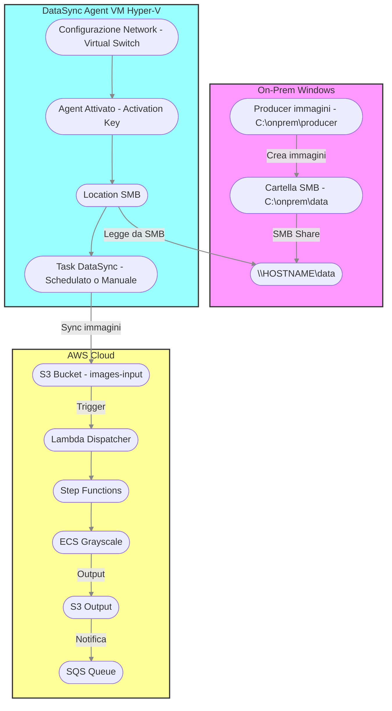

# On-Premises SMB → AWS DataSync Hybrid Pipeline

Questo README descrive passo-passo la configurazione di una solution **totalmente Windows** per sincronizzare automaticamente immagini generate localmente in una cartella SMB di Windows verso un bucket S3 `images-input-544547773663-eu-central-1` usando **AWS DataSync**.

---

## 1. Prerequisiti

* **Windows 10/11** con il ruolo **Hyper‑V** attivo.
* **AWS CLI** configurata con profilo/credenziali che abbiano permessi DataSync, S3 e IAM.
* (Opzionale) **Python 3** installato per il producer di immagini.

---

## 2. Creazione e Condivisione della cartella SMB

1. Apri PowerShell **Admin**.
2. Crea la directory locale:

   ```powershell
   New-Item -ItemType Directory -Path C:\onprem\data -Force
   ```
3. Imposta i permessi NTFS per **Everyone** (Full Control):

   ```powershell
   icacls C:\onprem\data /grant "Everyone:(OI)(CI)F" /T
   ```
4. Condividi in SMB la directory:

   ```powershell
   # Se la share esiste già, rimuovila:
   Remove-SmbShare -Name data -Force

   # Crea la nuova share
   New-SmbShare -Name data -Path C:\onprem\data -FullAccess Everyone
   ```
5. Verifica la condivisione:

   ```powershell
   Get-SmbShare -Name data | Format-Table Name,Path,ShareState
   ```

   Dovresti vedere `ShareState: Online`.

---

## 3. Configurazione del Virtual Switch Esterno in Hyper‑V

Per permettere alla VM DataSync di accedere alla rete del tuo host Windows:

1. In **Hyper‑V Manager**, apri **Virtual Switch Manager** → **New Virtual Network Switch** → **External**.
2. Seleziona la scheda di rete fisica (es. Wi‑Fi o Ethernet) su cui girerà.
3. Assegna un nome (ad esempio `ExternalNet`) e salva.
4. Nelle impostazioni della VM **AWS-DataSync-Agent**, sostituisci il suo **Network Adapter** per usare il switch `ExternalNet`.

---

## 4. Import e Configurazione della VM AWS DataSync Agent

1. Scarica l'OVA o il VHDX di DataSync Agent dalla console AWS.
2. In **Hyper‑V Manager**: **Import Virtual Machine** → punta alla cartella estratta → mantieni 2 vCPU e 4 GB RAM.
3. Avvia la VM.
4. Nel menu nero della VM, scegli **1: Network Configuration** → **2: DHCP** → conferma.
5. Attendi che `eth0` riceva un IP sulla rete `ExternalNet` (es. `192.168.1.x`).

   * Se non va in DHCP, seleziona **3: Manual** e inserisci:

     ```text
     IP address:   192.168.1.100
     Netmask:      255.255.255.0
     Gateway:      192.168.1.254
     DNS:          8.8.8.8,1.1.1.1
     ```

     conferma e riavvia (x → y).
6. Dal menu, seleziona **0: Get activation key**, copia la chiave.

---

## 5. Registrazione Agent in AWS

1. AWS Console → **DataSync** → **Agents** → **Create agent**
2. Incolla l'**Activation Key**.
3. Region = `eu-central-1`.
4. Attendi lo stato **ONLINE** e copia la **Agent ARN**.

---

## 6. (Opzionale) Producer di Immagini Locali

Se vuoi popolare automaticamente la share con file `.jpg`:

1. Installa Python e Pillow.
2. Copia lo script `onprem_image_producer.py` in `C:\onprem\producer`.
3. Modifica la path di default sul root `Z:\` mappata.
4. In PowerShell:

   ```powershell
   # Mappa la share SMB come unità Z:
   New-PSDrive -Name Z -PSProvider FileSystem -Root \\$env:COMPUTERNAME\data -Persist

   # Avvia il producer in background
   Start-Job -Name Producer -ScriptBlock {
       python C:\onprem\producer\onprem_image_producer.py --root Z:\
   }
   ```
5. Ogni 5 s verrà creato un nuovo `img_00001.jpg` in `Z:\`.

---

## 7. Creazione Location SMB in DataSync

> **Opzione A: creare nuova Location SMB**

```powershell
$agentArn = "arn:aws:datasync:eu-central-1:<AWS_ACCOUNT_ID>:agent/<agent-id>"

$SMB_SRC_LOC = aws datasync create-location-smb `
  --agent-arns $agentArn `
  --server-hostname "192.168.1.100" `
  --subdirectory data `
  --user "" --password "" --domain "" `
  --mount-options Version=SMB3 `
  --query LocationArn --output text

Write-Host "🔗 SMB Location ARN: $SMB_SRC_LOC"
```

> **Opzione B: usare una Location SMB esistente**

```powershell
$SMB_SRC_LOC = "arn:aws:datasync:eu-central-1:544547773663:location/loc-0be375f05b3abbda6"
```

---

## 8. Location S3 in DataSync

> **Opzione A: creare nuova Location S3**

```powershell
$bucket = "images-input-544547773663-eu-central-1"
$roleArn = aws iam create-role `
  --role-name DataSyncToS3Role `
  --assume-role-policy-document '{"Version":"2012-10-17","Statement":[{"Effect":"Allow","Principal":{"Service":"datasync.amazonaws.com"},"Action":"sts:AssumeRole"}]}' `
  --query Role.Arn --output text
aws iam attach-role-policy --role-name DataSyncToS3Role --policy-arn arn:aws:iam::aws:policy/AmazonS3FullAccess

$S3_DST_LOC = aws datasync create-location-s3 `
  --s3-bucket-arn arn:aws:s3:::$bucket `
  --s3-config BucketAccessRoleArn=$roleArn `
  --subdirectory / `
  --query LocationArn --output text
Write-Host "🎯 S3 Location ARN: $S3_DST_LOC"
```

> **Opzione B: usare un bucket S3 esistente**

```powershell
$S3_DST_LOC = "arn:aws:datasync:eu-central-1:<AWS_ACCOUNT_ID>:location/loc-XYZ_existing"
```

---

## 9. Creazione o Aggiornamento Task DataSync

```powershell
$taskName = "NfsToS3-HybridPipeline"

# Se il task esiste già, aggiorna le location:
aws datasync update-task `
  --task-arn arn:aws:datasync:eu-central-1:<AWS_ACCOUNT_ID>:task/<task-id> `
  --source-location-arn $SMB_SRC_LOC `
  --destination-location-arn $S3_DST_LOC

# Altrimenti crealo nuovo:
$taskArn = aws datasync create-task `
  --source-location-arn $SMB_SRC_LOC `
  --destination-location-arn $S3_DST_LOC `
  --name $taskName `
  --schedule "ScheduleExpression=rate(1 hour)" `
  --excludes FilterType=SIMPLE_PATTERN,Value=/processed/* `
  --query TaskArn --output text
Write-Host "🆕  Task ARN: $taskArn"
```

---

## 10. Esecuzione e Test End‑to‑End

1. Avvia manualmente (o attendi schedule):

   ```powershell
   aws datasync start-task-execution --task-arn $taskArn
   ```
2. Verifica in S3:

   ```powershell
   aws s3 ls s3://$bucket/ --recursive
   aws s3 ls s3://${bucket//input/output}/processed/ --recursive
   ```
3. Verifica SQS:

   ```powershell
   aws sqs receive-message --queue-url <ImageProcessingQueueURL> --max-number-of-messages 1
   ```
4. Verifica log:

   ```powershell
   aws logs tail /aws/lambda/ImageS3DispatcherLambda --since 10m
   aws logs tail /ecs/grayscale               --since 10m
   ```

---

## Diagramma di Flusso (Mermaid)



Se segui questi passaggi, avrai un flusso **Windows SMB → DataSync Agent → S3 → Lambda/ECS** completamente automatizzato, con la flessibilità di usare risorse nuove o esistenti 🚀
