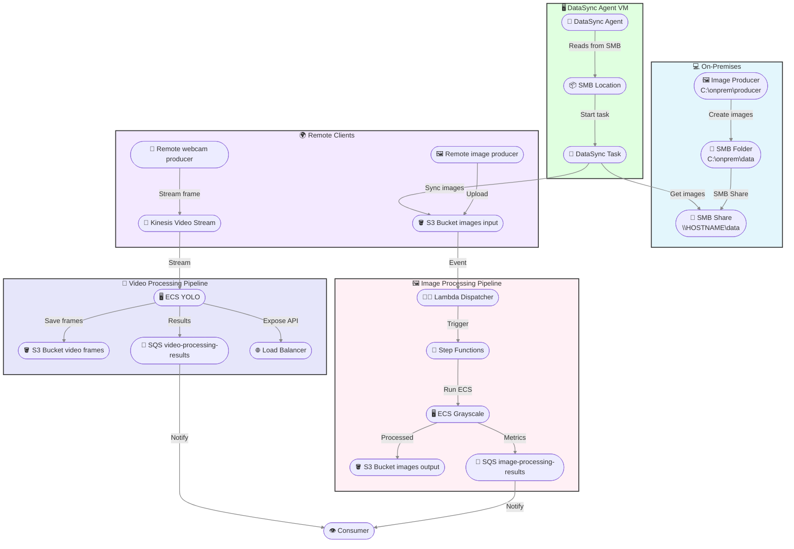

# On-Premises SMB → AWS DataSync Hybrid Pipeline

This README provides a step-by-step guide for configuring a **fully Windows-based** solution to automatically synchronize images generated locally in a Windows SMB folder to an S3 bucket `images-input-544547773663-eu-central-1` using **AWS DataSync**.

---

## 1. Prerequisites

* **Windows 10/11** with the **Hyper‑V** role enabled.
* **AWS CLI** configured with a profile/credentials with DataSync, S3, and IAM permissions.
* (Optional) **Python 3** installed for the image producer.

---

## 2. Create and Share the SMB Folder

1. Open PowerShell as **Admin**.
2. Create the local directory:

   ```powershell
   New-Item -ItemType Directory -Path C:\onprem\data -Force
   ```
3. Set NTFS permissions for **Everyone** (Full Control):

   ```powershell
   icacls C:\onprem\data /grant "Everyone:(OI)(CI)F" /T
   ```
4. Share the directory via SMB:

   ```powershell
   # If the share already exists, remove it:
   Remove-SmbShare -Name data -Force

   # Create the new share
   New-SmbShare -Name data -Path C:\onprem\data -FullAccess Everyone
   ```
5. Verify the share:

   ```powershell
   Get-SmbShare -Name data | Format-Table Name,Path,ShareState
   ```

   You should see `ShareState: Online`.

---

## 3. Configure the External Virtual Switch in Hyper‑V

To allow the DataSync VM to access your Windows host network:

1. In **Hyper‑V Manager**, open **Virtual Switch Manager** → **New Virtual Network Switch** → **External**.
2. Select the physical network adapter (e.g., Wi‑Fi or Ethernet) to use.
3. Assign a name (e.g., `ExternalNet`) and save.
4. In the **AWS-DataSync-Agent** VM settings, change its **Network Adapter** to use the `ExternalNet` switch.

---

## 4. Import and Configure the AWS DataSync Agent VM

1. Download the DataSync Agent OVA or VHDX from the AWS console.
2. In **Hyper‑V Manager**: **Import Virtual Machine** → point to the extracted folder → keep 2 vCPU and 4 GB RAM.
3. Start the VM.
4. In the VM's black menu, choose **1: Network Configuration** → **2: DHCP** → confirm.
5. Wait for `eth0` to get an IP on the `ExternalNet` network (e.g., `192.168.1.x`).

   * If DHCP does not work, select **3: Manual** and enter:

     ```text
     IP address:   192.168.1.100
     Netmask:      255.255.255.0
     Gateway:      192.168.1.254
     DNS:          8.8.8.8,1.1.1.1
     ```

     confirm and reboot (x → y).
6. From the menu, select **0: Get activation key**, copy the key.

---

## 5. Register the Agent in AWS

1. AWS Console → **DataSync** → **Agents** → **Create agent**
2. Paste the **Activation Key**.
3. Region = `eu-central-1`.
4. Wait for **ONLINE** status and copy the **Agent ARN**.

---

## 6. (Optional) Local Image Producer

If you want to automatically populate the share with `.jpg` files:

1. Install Python and Pillow.
2. Copy the script `onprem_image_producer.py` to `C:\onprem\producer`.
3. Edit the default path to the mapped root `Z:\`.
4. In PowerShell:

   ```powershell
   # Map the SMB share as drive Z:
   New-PSDrive -Name Z -PSProvider FileSystem -Root \\$env:COMPUTERNAME\data -Persist

   # Start the producer in background
   Start-Job -Name Producer -ScriptBlock {
       python C:\onprem\producer\onprem_image_producer.py --root Z:\
   }
   ```
5. Every 5 s a new `img_00001.jpg` will be created in `Z:\`.

---

## 7. Create SMB Location in DataSync

> **Option A: create a new SMB Location**

```powershell
$agentArn = "arn:aws:datasync:eu-central-1:<AWS_ACCOUNT_ID>:agent/<agent-id>"

$SMB_SRC_LOC = aws datasync create-location-smb `
  --agent-arns $agentArn `
  --server-hostname "192.168.1.100" `
  --subdirectory data `
  --user "" --password "" --domain "" `
  --mount-options Version=SMB3 `
  --query LocationArn --output text

Write-Host "🔗 SMB Location ARN: $SMB_SRC_LOC"
```

> **Option B: use an existing SMB Location**

```powershell
$SMB_SRC_LOC = "arn:aws:datasync:eu-central-1:544547773663:location/loc-0be375f05b3abbda6"
```

---

## 8. S3 Location in DataSync

> **Option A: create a new S3 Location**

```powershell
$bucket = "images-input-544547773663-eu-central-1"
$roleArn = aws iam create-role `
  --role-name DataSyncToS3Role `
  --assume-role-policy-document '{"Version":"2012-10-17","Statement":[{"Effect":"Allow","Principal":{"Service":"datasync.amazonaws.com"},"Action":"sts:AssumeRole"}]}' `
  --query Role.Arn --output text
aws iam attach-role-policy --role-name DataSyncToS3Role --policy-arn arn:aws:iam::aws:policy/AmazonS3FullAccess

$S3_DST_LOC = aws datasync create-location-s3 `
  --s3-bucket-arn arn:aws:s3:::$bucket `
  --s3-config BucketAccessRoleArn=$roleArn `
  --subdirectory / `
  --query LocationArn --output text
Write-Host "🎯 S3 Location ARN: $S3_DST_LOC"
```

> **Option B: use an existing S3 bucket**

```powershell
$S3_DST_LOC = "arn:aws:datasync:eu-central-1:<AWS_ACCOUNT_ID>:location/loc-XYZ_existing"
```

---

## 9. Create or Update DataSync Task

```powershell
$taskName = "NfsToS3-HybridPipeline"

# If the task already exists, update the locations:
aws datasync update-task `
  --task-arn arn:aws:datasync:eu-central-1:<AWS_ACCOUNT_ID>:task/<task-id> `
  --source-location-arn $SMB_SRC_LOC `
  --destination-location-arn $S3_DST_LOC

# Otherwise create a new one:
$taskArn = aws datasync create-task `
  --source-location-arn $SMB_SRC_LOC `
  --destination-location-arn $S3_DST_LOC `
  --name $taskName `
  --schedule "ScheduleExpression=rate(1 hour)" `
  --excludes FilterType=SIMPLE_PATTERN,Value=/processed/* `
  --query TaskArn --output text
Write-Host "🆕  Task ARN: $taskArn"
```

---

## 10. End-to-End Execution and Test

1. Start manually (or wait for schedule):

   ```powershell
   aws datasync start-task-execution --task-arn $taskArn
   ```
2. Check in S3:

   ```powershell
   aws s3 ls s3://$bucket/ --recursive
   aws s3 ls s3://${bucket//input/output}/processed/ --recursive
   ```
3. Check SQS:

   ```powershell
   aws sqs receive-message --queue-url <ImageProcessingQueueURL> --max-number-of-messages 1
   ```
4. Check logs:

   ```powershell
   aws logs tail /aws/lambda/ImageS3DispatcherLambda --since 10m
   aws logs tail /ecs/grayscale --since 10m
   ```

---

## Flow Diagram (Mermaid)



If you follow these steps, you will have a fully automated **Windows SMB → DataSync Agent → S3 → Lambda/ECS** flow, with the flexibility to use new or existing resources 🚀
