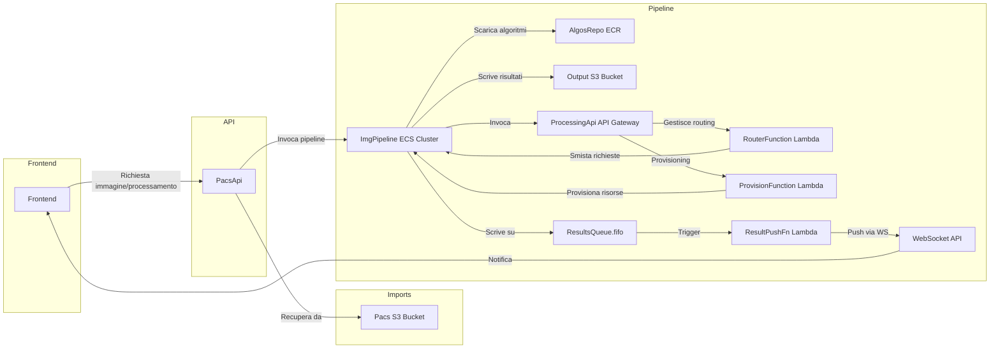

## 🏗️ Architettura

```
Client → API REST → SQS Requests → Fargate → SQS Results.fifo → Lambda ResultPush → WebSocket API → Client
```

- **Client**: invia job via HTTP
- **API Gateway**: espone endpoint REST
- **Lambda Router**: valida e smista i job
- **SQS Requests**: code FIFO per ogni algoritmo
- **Fargate Workers**: processano i job
- **SQS Results.fifo**: coda FIFO unica per tutti i risultati
- **Lambda ResultPush**: invia i risultati via WebSocket
- **WebSocket API**: notifiche push dei risultati ai client
- **Frontend React**: provisioning, invio job, ricezione risultati real-time

---

## 5️⃣ Flusso utente end‑to‑end

1. **Anteprima PACS**
   - Inserisci `study_id`, `series_id`, `image_id`, `scope=image`
   - Clicca _Carica Anteprima_ → visualizzi l’immagine originale
2. **Provision client**
   - Clicca _Provisiona client_ → ricevi solo `client_id`
3. **Avvio processing**
   - Clicca _Avvia processing_ → invia POST a `$API_BASE/process/processing_1` con payload PACS + `client_id`
   - Lambda Router mette il job su SQS Requests
   - Fargate Worker elabora e pubblica su ResultsQueue.fifo
   - Lambda ResultPush invia il risultato via WebSocket al client giusto
4. **Ricezione risultati (push)**
   - Il frontend apre una WebSocket a `wss://.../prod?client_id=...`
   - Quando arriva il messaggio (`job_id`), vedi l’immagine processata

---

## Output deploy

- DNS PACS API LB (`PacsApiLB`)
- API Gateway endpoint (`ProcessingApiEndpoint`)
- URL SQS Requests per ogni algoritmo
- WebSocket endpoint (`WebSocketEndpoint`)
- ResultsQueueUrl (`ResultsQueueUrl`)

**Variabili disponibili:**
- `$Env:API_BASE`         → API Gateway
- `$Env:PACS_API_BASE`    → DNS PACS API
- `$Env:WS_ENDPOINT`      → WebSocket endpoint
- `$Env:RESULTS_QUEUE_URL`→ ResultsQueueUrl

---

## Flusso architetturale (aggiornato)



---

## Best practice e monitoraggio

- Lambda on_disconnect: fail fast (retry 0), return 200 se nessun item trovato.
- Lambda result_push: logging avanzato e metriche CloudWatch EMF per push, failure e disconnect.
- Lambda push: batch/concurrency SQS, Lambda Insights, retention log 1 giorno.
- Frontend: reconnessione WebSocket automatica, ping ogni 5 min, fallback toast se non parte.
- Monitoring: ApproximateAgeOfOldestMessage su ResultsQueue, allarmi su PushFailures/Disconnected.

# Try it!

---

## 🛠️ Prerequisiti

- AWS CLI configurato (CloudFormation, ECR, ECS, SQS, SNS, Lambda, IAM)
- AWS CDK v2
- Docker
- PowerShell (Windows) o Bash (Linux/macOS)
- Node.js + npm (per il frontend React)

---

## 1️⃣ Preparazione ECR

**Crea i repository e push delle immagini**

```powershell
cd infra/ecr
./create-ecr-repos.ps1 -Region <REGION> -Account <ACCOUNT_ID>
docker build --no-cache -t mip-base:latest -f containers/base/Dockerfile . #se si vuole ripartire alla base senza cache
./push-algos.ps1 -Region <REGION> -Account <ACCOUNT_ID>
./push-pacs.ps1 -Region <REGION> -Account <ACCOUNT_ID>
```

> _Nota: <REGION> es. eu-central-1 o us-east-1; <ACCOUNT_ID> es. 544547773663._

---

## 2️⃣ Deploy infrastruttura con CDK

```bash
cd infra
npm install   # solo se ci sono dipendenze node
cdk deploy Imports --require-approval never
cdk deploy PacsApiStack --require-approval never
cdk deploy ImgPipeline --require-approval never
# oppure
cdk deploy --all --require-approval never
```

**Output deploy:**
- DNS PACS API LB (`PacsApiLB`)
- API Gateway endpoint (`ProcessingApiEndpoint`)
- URL SQS Requests/Results per ogni algoritmo
- SNS Topic ARN (`ImageResultsTopicArn`)

---

## 3️⃣ Generazione variabili d’ambiente

Script PowerShell per raccogliere gli output CDK:

```powershell
./gen_env/gen_env.ps1 -ImgStack "ImgPipeline" -PacsStack "PacsApiStack"
. ./infra/env.ps1   # importa le variabili in sessione
```

---

## 4️⃣ Frontend React

```bash
cd infra/clients/react-app
npm ci
npm start
```

Nel file `src/index.jsx`:
```js
const API_BASE  = process.env.API_BASE    || '<YOUR_API_GATEWAY_BASE>';
const PACS_BASE = process.env.PACS_API_BASE || '<YOUR_PACS_API_BASE>';
```
Apri il browser su [http://localhost:3000](http://localhost:3000).

---
