# 🎥 CV2Kinesis - Real-time Video Object Detection Pipeline

Soluzione production-ready per object detection real-time su video stream utilizzando AWS serverless infrastructure e YOLOv8.

## 🎯 Architettura

```mermaid
graph LR
    A[🎥 Frontend<br/>Webcam] --> B[📡 Kinesis<br/>cv2kinesis]
    B --> C[🐳 ECS Fargate<br/>YOLOv8]
    C --> D[📦 S3<br/>Storage]
    C --> E[📨 SQS<br/>processing-results]
    E --> F[👁️ Frontend<br/>Consumer]
    
    style A fill:#e1f5fe
    style B fill:#f3e5f5
    style C fill:#fff3e0
    style D fill:#e8f5e8
    style E fill:#fff8e1
    style F fill:#e1f5fe
```



## 🚀 Quick Start

### Deploy Infrastruttura
```bash
# Clone repository
git clone <repository-url>
cd cv2kinesis

# Deploy completo AWS infrastructure
python deploy_and_test.py
# Scegli: 1. Build e deploy completo
```

### Test Pipeline
```bash
# Test end-to-end con webcam
python deploy_and_test.py
# Scegli: 6. Test completo (producer + consumer)
```

## 📚 Guide per Team

### 🏗️ Team Infrastrutturale
**[docs/INFRASTRUCTURE_GUIDE.md](docs/INFRASTRUCTURE_GUIDE.md)**
- Deploy e gestione infrastruttura AWS
- Monitoring e troubleshooting
- Scaling e ottimizzazione costi
- Security e backup

### 🎨 Team Frontend  
**[docs/FRONTEND_INTEGRATION_GUIDE.md](docs/FRONTEND_INTEGRATION_GUIDE.md)**
- Integrazione completa frontend
- Template JavaScript/React
- API Kinesis e SQS
- Esempi pratici e best practices

## 📋 Struttura Repository

```
cv2kinesis/
├── 📄 deploy_and_test.py          # 🚀 Deploy e test completo infrastruttura
├── 📄 sqs_consumer.py             # � Consumer SQS standalone per debug
├── � docs/                       # � Guide per team di sviluppo
│   ├── INFRASTRUCTURE_GUIDE.md    # 🏗️ Guida team infrastrutturale
│   └── FRONTEND_INTEGRATION_GUIDE.md # 🎨 Guida team frontend
├── 📂 cdk/                        # ☁️ Infrastructure as Code
│   ├── pipeline_stack.py          # 🏗️ Definizione stack AWS CDK
│   ├── app.py                     # 🚀 CDK app principale
│   └── diagram_generator.py       # 📊 Generatore diagrammi architettura
├── 📂 stream_service/             # 🐳 Docker service YOLOv8
│   ├── app.py                     # 🧠 YOLOv8 processing logic
│   ├── Dockerfile                 # 🐳 Container configuration
│   └── requirements.txt           # 📦 Python dependencies
├── 📂 simple/                     # 🧪 Test utilities
│   ├── producer.py                # 📹 Video producer per test
│   └── consumer.py                # 📥 Consumer risultati per test
└── 📂 demo_videos/                # 🎬 Video di esempio per testing
```

## 🎯 API Interface

### Input: Kinesis Stream
- **Stream Name**: `cv2kinesis`
- **Region**: `eu-central-1`
- **Format**: JPEG base64 @ 10 FPS max
- **Data**: JSON con timestamp, frame_id, frame_data

### Output: SQS Queue  
- **Queue URL**: `https://sqs.eu-central-1.amazonaws.com/544547773663/processing-results`
- **Format**: JSON con detections array
- **Polling**: Long polling raccomandato (WaitTimeSeconds: 20)

## 🧪 Testing e Debug

### Test Disponibili
```bash
python deploy_and_test.py
```

Opzioni:
1. **Build e deploy completo** - Setup infrastruttura AWS completa
2. **Solo build Docker** - Build e push immagine ECR  
3. **Solo deploy CDK** - Deploy stack CloudFormation
4. **Test producer** - Invia video da webcam a Kinesis
5. **Test consumer** - Ricevi risultati da SQS
6. **Test end-to-end** - Producer + Consumer simultanei

### Debug Tools
```bash
# Consumer SQS standalone
python sqs_consumer.py

# Verifica stack AWS
aws cloudformation describe-stacks --stack-name VideoPipelineStack

# Logs ECS real-time
aws logs tail /ecs/videoPipeline --follow
```

## 🔧 Configurazione

### Prerequisiti
- **Python 3.8+** con pip
- **Docker** per build immagini
- **AWS CLI** configurato con credenziali
- **CDK** installato (`npm install -g aws-cdk`)

### Environment Setup
```bash
# Install dependencies
pip install -r requirements.txt

# Install CDK dependencies  
cd cdk && npm install

# Configure AWS
aws configure
```

## 📊 Componenti AWS

### Automatically Deployed
- ✅ **Kinesis Data Stream** per video input
- ✅ **ECS Fargate Cluster** con YOLOv8 processing
- ✅ **ECR Repository** per Docker images
- ✅ **S3 Bucket** per storage risultati processati
- ✅ **SQS Queue** per delivery risultati asincrono
- ✅ **Application Load Balancer** per health checks
- ✅ **VPC + Security Groups** per networking
- ✅ **IAM Roles** con least privilege permissions

### Stack Outputs
Dopo il deploy ottieni automaticamente:
```
LoadBalancerURL: http://videopipeline-alb-xxx.eu-central-1.elb.amazonaws.com
S3BucketName: processedframes-544547773663-eu-central-1  
SQSQueueURL: https://sqs.eu-central-1.amazonaws.com/544547773663/processing-results
KinesisStreamName: cv2kinesis
```

## 🎨 Classi Oggetti Supportate

YOLOv8 riconosce 80 classi COCO dataset:
- **Persone**: person
- **Veicoli**: car, motorcycle, airplane, bus, train, truck, boat
- **Elettronica**: cell phone, laptop, mouse, remote, keyboard  
- **Animali**: cat, dog, horse, sheep, cow, elephant, bear, zebra
- **Sport**: frisbee, skis, snowboard, sports ball, kite, surfboard
- **Cibo**: apple, orange, banana, carrot, hot dog, pizza, donut
- E molti altri...

## � Costi Stimati

```
Kinesis Stream:     ~$15/mese (1 shard)
ECS Fargate:        ~$30/mese (auto-scaling)
S3 Storage:         ~$1/mese (100GB)
SQS Messages:       ~$1/mese (1M messages)
Load Balancer:      ~$20/mese
Data Transfer:      ~$5/mese
TOTALE:            ~$72/mese
```

## 🚨 Note Importanti

### Performance
- **Latency**: ~2-5 secondi end-to-end
- **Throughput**: 1000 frame/sec max (Kinesis limit)
- **Frame Rate**: 10 FPS raccomandato per costi ottimali
- **Auto-scaling**: ECS scale 0-10 task based su load

### Sicurezza
- ✅ **VPC isolato** per tutti i servizi
- ✅ **IAM roles** con minimal permissions
- ✅ **Security groups** restrictive
- ✅ **Encryption** at rest e in transit
- ⚠️ **Frontend credentials**: Usa IAM roles in produzione

## 🆘 Support

### Troubleshooting Common Issues
1. **Stream not found** → Verifica deploy CDK completato
2. **No detection results** → Verifica ECS task running
3. **Rate limiting** → Riduci frame rate sotto 10 FPS
4. **High latency** → Normale per cold start ECS

### Getting Help
- � **Infrastructure Team**: [docs/INFRASTRUCTURE_GUIDE.md](docs/INFRASTRUCTURE_GUIDE.md)
- 🎨 **Frontend Team**: [docs/FRONTEND_INTEGRATION_GUIDE.md](docs/FRONTEND_INTEGRATION_GUIDE.md)
- 🧪 **Testing**: `python deploy_and_test.py`
- 📊 **Monitoring**: CloudWatch logs e metrics

---

## 🎯 Summary

Pipeline completa e production-ready per object detection real-time:
- **Backend**: Completamente serverless e auto-scalabile su AWS
- **Frontend**: API semplici per integrazione in qualsiasi applicazione web
- **Testing**: Tool automatici per validazione end-to-end
- **Documentation**: Guide specifiche per ogni team di sviluppo

**🚀 Ready to integrate real-time AI object detection in your application!**

```python
import cv2 as cv
from ultralytics import YOLO
import logging

logging.getLogger("ultralytics").setLevel(logging.WARNING)

logging.basicConfig(
    format='%(asctime)s [%(levelname)s] %(message)s',
    level='INFO',
    datefmt='%d/%m/%Y %X')

logger = logging.getLogger(__name__)

X_RESIZE = 800
Y_RESIZE = 450

YOLO_MODEL="yolov8m.pt"
YOLO_CLASSES_TO_DETECT = 'bottle',
THRESHOLD = 0.80

cap = cv.VideoCapture(0)
model = YOLO(YOLO_MODEL)
while True:
    _, original_frame = cap.read()
    frame = cv.resize(original_frame, (X_RESIZE, Y_RESIZE), interpolation=cv.INTER_LINEAR)

    results = model.predict(frame)

    color = (0, 255, 0)
    for result in results:
        for box in result.boxes:
            class_id = result.names[box.cls[0].item()]
            status = id == class_id
            cords = box.xyxy[0].tolist()
            probability = round(box.conf[0].item(), 2)

            if probability > THRESHOLD and class_id in YOLO_CLASSES_TO_DETECT:
                logger.info(f"{class_id} {round(probability * 100)}%")
                x1, y1, x2, y2 = [round(x) for x in cords]
                cv.rectangle(frame, (x1, y1), (x2, y2), color, 2)

    cv.imshow(f"Cam", frame)

    if cv.waitKey(1) & 0xFF == ord('q'):
        break

cap.release()
cv.destroyAllWindows()
```

However, my idea is slightly different. I intend to capture the camera stream, transmit it to AWS Kinesis, and subsequently, within a separate process, ingest this Kinesis stream for object detection or any other purpose using the camera frames. To achieve this, our initial step is to publish our OpenCV frames into Kinesis.
producer.py
```python
import logging

from lib.video import kinesis_producer
from settings import KINESIS_STREAM_NAME, CAM_URI, WIDTH

logging.basicConfig(
    format='%(asctime)s [%(levelname)s] %(message)s',
    level='INFO',
    datefmt='%d/%m/%Y %X')

logger = logging.getLogger(__name__)

if __name__ == '__main__':
    kinesis_producer(
        kinesis_stream_name=KINESIS_STREAM_NAME,
        cam_uri=CAM_URI,
        width=WIDTH
    )
```

```python
def kinesis_producer(kinesis_stream_name, cam_uri, width):
    logger.info(f"start emitting stream from cam={cam_uri} to kinesis")
    kinesis = aws_get_service('kinesis')
    cap = cv.VideoCapture(cam_uri)
    try:
        while True:
            ret, frame = cap.read()
            if ret:
                scale = width / frame.shape[1]
                height = int(frame.shape[0] * scale)

                scaled_frame = cv.resize(frame, (width, height))
                _, img_encoded = cv.imencode('.jpg', scaled_frame)
                kinesis.put_record(
                    StreamName=kinesis_stream_name,
                    Data=img_encoded.tobytes(),
                    PartitionKey='1'
                )

    except KeyboardInterrupt:
        cap.release()
```

Now our consumer.py

```python
import logging

from lib.video import kinesis_consumer
from settings import KINESIS_STREAM_NAME

logging.getLogger("ultralytics").setLevel(logging.WARNING)

logging.basicConfig(
    format='%(asctime)s [%(levelname)s] %(message)s',
    level='INFO',
    datefmt='%d/%m/%Y %X')

logger = logging.getLogger(__name__)

if __name__ == '__main__':
    kinesis_consumer(
        kinesis_stream_name=KINESIS_STREAM_NAME
    )
```

To get the frames from kinesis stream we need to consider the shards. According to your needs you should 
change it a little bit.

```python
def kinesis_consumer(kinesis_stream_name):
    logger.info(f"start reading kinesis stream from={kinesis_stream_name}")
    kinesis = aws_get_service('kinesis')
    model = YOLO(YOLO_MODEL)
    response = kinesis.describe_stream(StreamName=kinesis_stream_name)
    shard_id = response['StreamDescription']['Shards'][0]['ShardId']
    while True:
        shard_iterator_response = kinesis.get_shard_iterator(
            StreamName=kinesis_stream_name,
            ShardId=shard_id,
            ShardIteratorType='LATEST'
        )
        shard_iterator = shard_iterator_response['ShardIterator']
        response = kinesis.get_records(
            ShardIterator=shard_iterator,
            Limit=10
        )

        for record in response['Records']:
            image_data = record['Data']
            frame = cv.imdecode(np.frombuffer(image_data, np.uint8), cv.IMREAD_COLOR)
            results = model.predict(frame)
            if detect_id_in_results(results):
                logger.info('Detected')

def detect_id_in_results(results):
    status = False
    for result in results:
        for box in result.boxes:
            class_id = result.names[box.cls[0].item()]
            probability = round(box.conf[0].item(), 2)
            if probability > THRESHOLD and class_id in YOLO_CLASSES_TO_DETECT:
                status = True
    return status
```

And that's all. Real-time Object Detection with Kinesis stream. However, computer vision examples are often simple and quite straightforward. On the other hand, real-world computer vision projects tend to be more intricate, involving considerations such as cameras, lighting conditions, performance optimization, and accuracy. But remember, this is just an example.

## Deploying the Serverless Demo

Use the CDK project in `cdk/` to provision Kinesis and an ECS Fargate service that runs the container from `stream_service/`. Build and push the container image to Amazon ECR, then deploy the stack:

```bash
cd stream_service && docker build -t cv2kinesis:latest .

# create or locate an ECR repository
aws ecr create-repository --repository-name cv2kinesis || true
AWS_ACCOUNT_ID=$(aws sts get-caller-identity --query Account --output text)
AWS_REGION=eu-central-1  # adjust if needed
aws ecr get-login-password --region $AWS_REGION | \
  docker login --username AWS --password-stdin $AWS_ACCOUNT_ID.dkr.ecr.$AWS_REGION.amazonaws.com
docker tag cv2kinesis:latest $AWS_ACCOUNT_ID.dkr.ecr.$AWS_REGION.amazonaws.com/cv2kinesis:latest
docker push $AWS_ACCOUNT_ID.dkr.ecr.$AWS_REGION.amazonaws.com/cv2kinesis:latest

# deploy using the pushed image
cd ../cdk && cdk deploy -c image_uri=$AWS_ACCOUNT_ID.dkr.ecr.$AWS_REGION.amazonaws.com/cv2kinesis:latest
```

or for Windows:

```powershell
# Build the Docker image
Set-Location stream_service
docker build -t cv2kinesis:latest .

# Create or locate an ECR repository
try { aws ecr create-repository --repository-name cv2kinesis } catch { Write-Host "Repository may already exist" }

# Get AWS account ID and set region
$AWS_ACCOUNT_ID = aws sts get-caller-identity --query Account --output text
$AWS_REGION = "eu-central-1"  # adjust if needed

# Login to ECR
$loginPassword = aws ecr get-login-password --region $AWS_REGION
$loginPassword | docker login --username AWS --password-stdin "$AWS_ACCOUNT_ID.dkr.ecr.$AWS_REGION.amazonaws.com"

# Tag and push the image
docker tag cv2kinesis:latest "$AWS_ACCOUNT_ID.dkr.ecr.$AWS_REGION.amazonaws.com/cv2kinesis:latest"
docker push "$AWS_ACCOUNT_ID.dkr.ecr.$AWS_REGION.amazonaws.com/cv2kinesis:latest"

# Deploy using the pushed image
Set-Location ../cdk
cdk deploy -c "image_uri=$AWS_ACCOUNT_ID.dkr.ecr.$AWS_REGION.amazonaws.com/cv2kinesis:latest"
```

The stack outputs the Kinesis stream name and the URL where the processed video can be viewed. Destroy all resources with `cdk destroy`.