# 🏗️ Infrastructure Guide - Team Infrastrutturale

Guida completa per il deploy e la gestione dell'infrastruttura AWS per la pipeline di object detection real-time.

## 🎯 Architettura

```mermaid
graph TB
    subgraph "AWS Cloud Infrastructure"
        KDS[📡 Kinesis Data Stream<br/>'cv2kinesis']
        ECS[🐳 ECS Fargate Cluster<br/>YOLOv8 Processing]
        S3[📦 S3 Bucket<br/>Processed Images]
        SQS[📨 SQS Queue<br/>'processing-results']
        ECR[🐳 ECR Repository<br/>Docker Images]
        ALB[⚖️ Application Load Balancer]
        VPC[🌐 VPC + Subnets]
    end
    
    subgraph "Deploy Tools"
        CDK[☁️ AWS CDK<br/>Infrastructure as Code]
        DOCKER[🐳 Docker<br/>Container Build]
    end
    
    CDK --> KDS
    CDK --> ECS
    CDK --> S3
    CDK --> SQS
    CDK --> ECR
    CDK --> ALB
    CDK --> VPC
    DOCKER --> ECR
    
    style KDS fill:#1976d2,color:white
    style ECS fill:#388e3c,color:white
    style S3 fill:#f57c00,color:white
    style SQS fill:#7b1fa2,color:white
    style ECR fill:#455a64,color:white
```



## 🚀 Deploy Completo

### Prerequisiti
```bash
# AWS CLI configurato
aws configure

# Docker installato e funzionante
docker --version

# CDK installato
npm install -g aws-cdk

# Python dependencies
pip install -r requirements.txt
```

### Deploy Automatico
```bash
# Deploy completo con un comando
python deploy_and_test.py
# Scegli: 1. Build e deploy completo
```

**Quello che succede automaticamente:**
1. 🐳 Build immagine Docker YOLOv8
2. 🚀 Push su ECR repository
3. ☁️ Deploy stack CDK completo
4. ✅ Verifica servizi attivi

### Deploy Manuale (Step by Step)

#### 1. Build e Push Docker Image
```bash
# Build immagine
cd stream_service
docker build -t cv2kinesis:latest .

# Login ECR
aws ecr get-login-password --region eu-central-1 | docker login --username AWS --password-stdin 544547773663.dkr.ecr.eu-central-1.amazonaws.com

# Tag e push
docker tag cv2kinesis:latest 544547773663.dkr.ecr.eu-central-1.amazonaws.com/cv2kinesis:latest
docker push 544547773663.dkr.ecr.eu-central-1.amazonaws.com/cv2kinesis:latest
```

#### 2. Deploy Stack CDK
```bash
# Deploy infrastruttura
cd cdk
cdk deploy --require-approval never
```

## 📋 Componenti Infrastruttura

### Kinesis Data Stream
- **Nome**: `cv2kinesis`
- **Shards**: 1 (auto-scaling disponibile)
- **Retention**: 24 ore
- **Throughput**: 1000 record/sec, 1MB/sec

### ECS Fargate Cluster
- **Cluster**: `VideoPipelineStack-Cluster`
- **Service**: Auto-scaling 0-10 task
- **Task Definition**: 
  - CPU: 512 (0.5 vCPU)
  - Memory: 2048 MB (2 GB)
  - Image: YOLOv8 + OpenCV

### S3 Storage
- **Bucket**: `processedframes-{account}-{region}`
- **Lifecycle**: 7 giorni retention
- **Versioning**: Disabilitato per demo
- **Encryption**: AES-256

### SQS Queue
- **Nome**: `processing-results`
- **Type**: Standard queue
- **Visibility Timeout**: 300 secondi
- **Message Retention**: 14 giorni

### Networking
- **VPC**: Dedicato con 2 AZ
- **Subnets**: Public e Private
- **Security Groups**: Configurati per ECS
- **Load Balancer**: Application LB per health check

## 🔧 Configurazione e Customizzazione

### Modifica Risorse
Edita `cdk/pipeline_stack.py`:

```python
# Esempio: Aumentare CPU/Memory ECS
task_definition.add_container(
    "YoloContainer",
    cpu=1024,  # 1 vCPU
    memory_limit_mib=4096,  # 4 GB
    # ...
)

# Esempio: Aumentare shards Kinesis
stream = kinesis.Stream(
    self,
    "FrameStream", 
    stream_name="cv2kinesis",
    shard_count=2  # 2 shards
)
```

### Environment Variables ECS
```python
# In pipeline_stack.py
container.add_environment("YOLO_MODEL_SIZE", "yolov8m")  # n, s, m, l, x
container.add_environment("CONFIDENCE_THRESHOLD", "0.5")
container.add_environment("MAX_DETECTIONS", "100")
```

## 📊 Monitoring e Logging

### Stack Outputs
Dopo il deploy:
```bash
aws cloudformation describe-stacks --stack-name VideoPipelineStack --query 'Stacks[0].Outputs'
```

Output importanti:
- `LoadBalancerURL`: Health check endpoint
- `S3BucketName`: Bucket immagini processate  
- `SQSQueueURL`: URL coda risultati
- `KinesisStreamName`: Nome stream input

### CloudWatch Metrics
```bash
# Metriche Kinesis
aws cloudwatch get-metric-statistics \
  --namespace AWS/Kinesis \
  --metric-name IncomingRecords \
  --dimensions Name=StreamName,Value=cv2kinesis \
  --start-time 2024-01-01T00:00:00Z \
  --end-time 2024-01-01T23:59:59Z \
  --period 300 \
  --statistics Sum

# Metriche ECS
aws cloudwatch get-metric-statistics \
  --namespace AWS/ECS \
  --metric-name CPUUtilization \
  --dimensions Name=ServiceName,Value=VideoPipelineStack-Service \
  --start-time 2024-01-01T00:00:00Z \
  --end-time 2024-01-01T23:59:59Z \
  --period 300 \
  --statistics Average
```

### Logs ECS
```bash
# Lista log groups
aws logs describe-log-groups --log-group-name-prefix /ecs/

# Logs real-time
aws logs tail /ecs/videoPipeline --follow
```

## 🧪 Testing Infrastruttura

### Health Check
```bash
# Verifica Load Balancer
curl http://$(aws cloudformation describe-stacks --stack-name VideoPipelineStack --query 'Stacks[0].Outputs[?OutputKey==`LoadBalancerURL`].OutputValue' --output text)/health

# Verifica stream Kinesis
aws kinesis describe-stream --stream-name cv2kinesis

# Verifica task ECS
aws ecs list-tasks --cluster VideoPipelineStack-Cluster
```

### Test End-to-End
```bash
# Test completo della pipeline
python deploy_and_test.py
# Scegli: 6. Test completo (producer + consumer)
```

## 🔒 Sicurezza e IAM

### IAM Roles Creati
- **ECS Task Role**: Permessi per S3, SQS, CloudWatch
- **ECS Execution Role**: Permessi per ECR, CloudWatch Logs
- **Kinesis Service Role**: Trigger ECS da Kinesis

### Security Groups
- **ALB Security Group**: Port 80 inbound
- **ECS Security Group**: Port 8080 da ALB only
- **No SSH access**: Security by design

### Encryption
- **Kinesis**: Encryption at rest
- **S3**: AES-256 encryption
- **SQS**: Encryption in transit
- **ECS**: Secrets in AWS Systems Manager

## 💰 Cost Optimization

### Costi Stimati (eu-central-1)
```
Kinesis Stream:     ~$15/mese (1 shard)
ECS Fargate:        ~$30/mese (running continuo)
S3 Storage:         ~$1/mese (100GB)
SQS Messages:       ~$1/mese (1M messages)
Data Transfer:      ~$5/mese
ALB:               ~$20/mese
TOTALE:            ~$72/mese
```

### Ottimizzazioni
```python
# Auto-scaling ECS per ridurre costi
auto_scaling_target = service.auto_scale_task_count(
    min_capacity=0,  # Scale to zero when no traffic
    max_capacity=5
)

# Scale up su CPU
auto_scaling_target.scale_on_cpu_utilization(
    "CpuScaling",
    target_utilization_percent=70,
    scale_in_cooldown=Duration.minutes(5),
    scale_out_cooldown=Duration.minutes(2)
)
```

## 🚨 Troubleshooting

### Problemi Comuni

#### 1. Deploy CDK Fallisce
```bash
# Verifica credenziali
aws sts get-caller-identity

# Verifica region
aws configure list

# Bootstrap CDK (se primo deploy)
cdk bootstrap aws://ACCOUNT/REGION
```

#### 2. ECS Task Non Si Avvia
```bash
# Verifica task definition
aws ecs describe-task-definition --task-definition videoPipeline

# Verifica logs
aws logs tail /ecs/videoPipeline --follow

# Verifica ECR permissions
aws ecr describe-repositories --repository-names cv2kinesis
```

#### 3. Kinesis Stream Non Triggera ECS
```bash
# Verifica event source mapping
aws lambda list-event-source-mappings

# Verifica policy IAM
aws iam get-role-policy --role-name VideoPipelineStack-TaskRole --policy-name default-policy
```

### Recovery Procedures

#### Riavvio Servizio ECS
```bash
# Force new deployment
aws ecs update-service \
  --cluster VideoPipelineStack-Cluster \
  --service VideoPipelineStack-Service \
  --force-new-deployment
```

#### Pulizia e Redeploy
```bash
# Destroy stack
cd cdk
cdk destroy

# Redeploy
python deploy_and_test.py
# Opzione 1: Build e deploy completo
```

## 📈 Scaling e Performance

### Horizontal Scaling
```python
# Aumenta shards Kinesis per throughput
stream = kinesis.Stream(
    self,
    "FrameStream",
    shard_count=5  # 5x throughput
)

# Auto-scaling ECS più aggressivo
auto_scaling_target = service.auto_scale_task_count(
    min_capacity=2,   # Always-on capacity
    max_capacity=20   # Peak capacity
)
```

### Vertical Scaling
```python
# Task ECS più potenti
task_definition = ecs.FargateTaskDefinition(
    self, "TaskDef",
    memory_limit_mib=8192,  # 8 GB
    cpu=2048                # 2 vCPU
)
```

## 📞 Support e Manutenzione

### Comandi Utili
```bash
# Status generale
aws cloudformation describe-stacks --stack-name VideoPipelineStack

# Logs real-time
aws logs tail /ecs/videoPipeline --follow

# Metriche dashboard
aws cloudwatch get-dashboard --dashboard-name VideoPipeline

# Update immagine Docker
python deploy_and_test.py  # Opzione 2: Solo build Docker
```

### Backup e Disaster Recovery
- **Infrastructure as Code**: Stack CDK versionato in Git
- **Docker Images**: Versioning in ECR
- **Configuration**: Environment variables in Systems Manager
- **Data**: S3 cross-region replication (opzionale)

---

**🎯 Obiettivo**: Mantenere una pipeline robust, scalabile e cost-effective per object detection real-time.**
